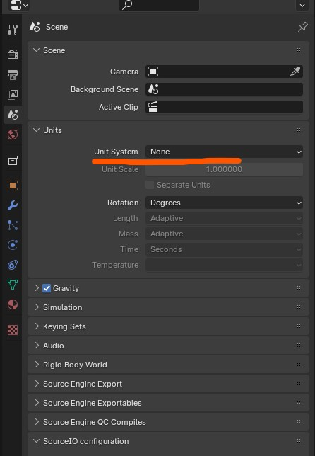
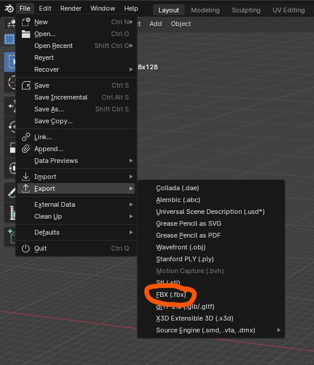
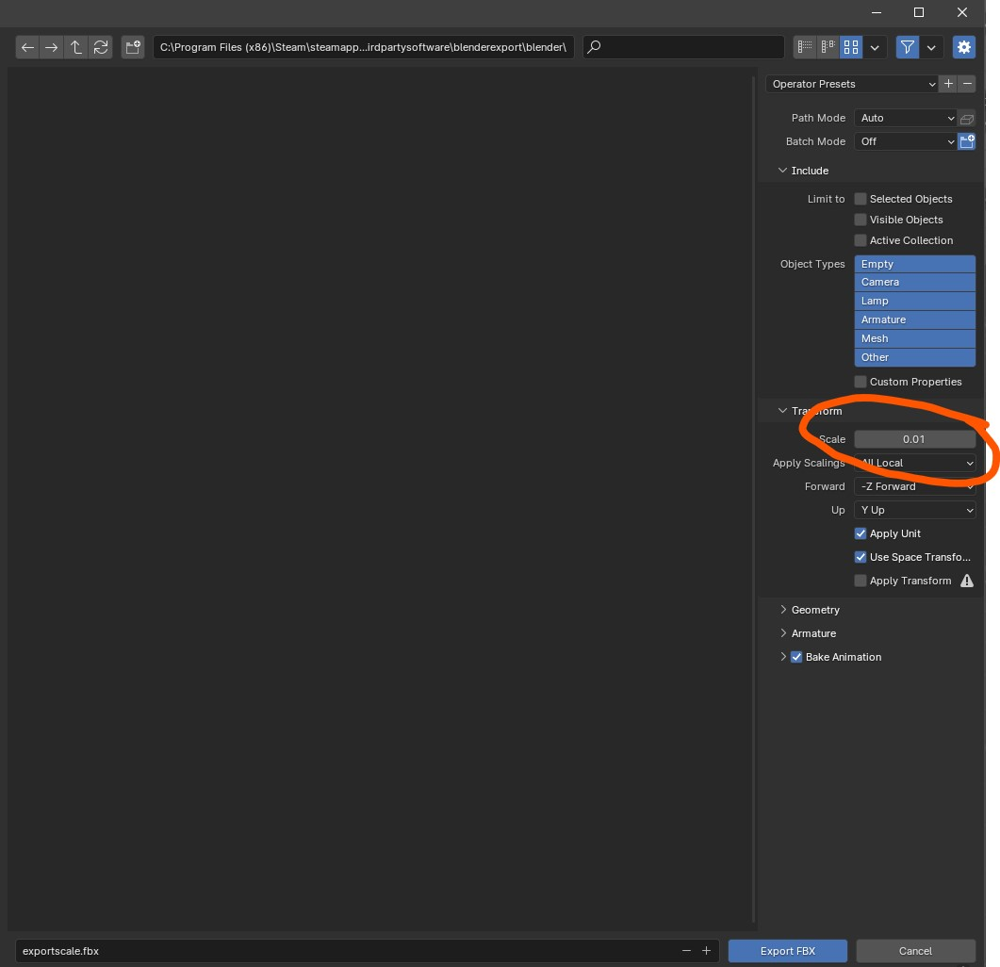
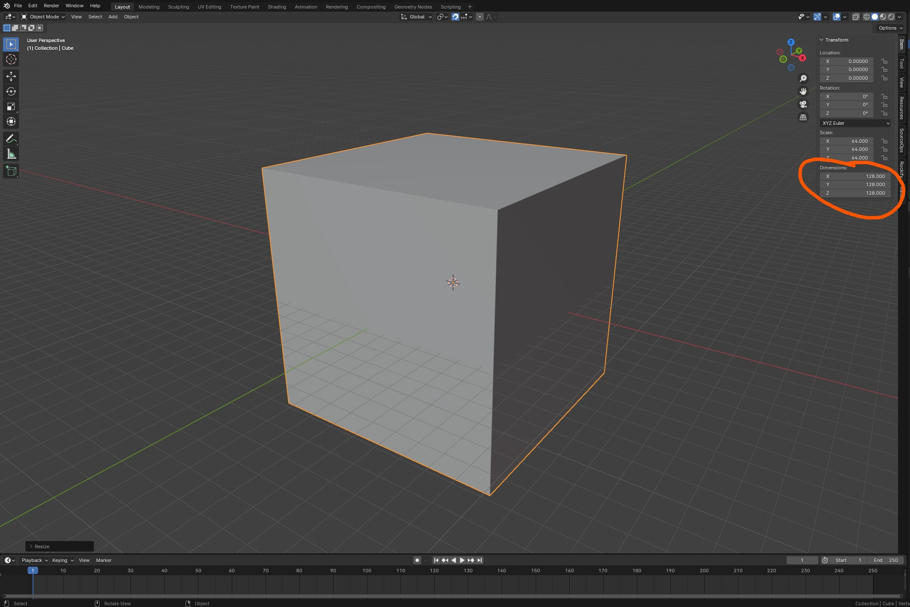
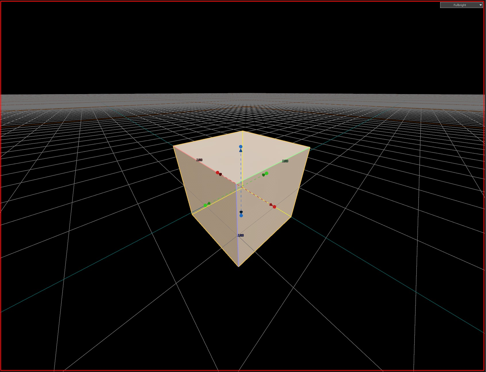

This guide explains how to to export blender geometry to Source 2 in 1:1 scale.  

---
We will use `.fbx` files for the tutorial.

It is highly recommended to set your scene units to `None`. When exporting meshes to advanced formats such as `.fbx`, `.glb`, or `.gltf`, these file types often include metadata containing the scene’s unit scale. Different software handle this differently — for example, Maya
 uses the metric system by default, while Adobe Substance 3D Designer defaults to the imperial system.

To avoid scaling inconsistencies when re-exporting your models later for Source 2 or other engines, it’s best to set your scene units to None. This ensures a consistent, unitless scale across all tools in your personal or team pipeline.

:::note
It is highly recomended to avoid `.obj` files, becouse there are many missing features or lack of standarization. For more information see the dropdown table.
:::

**Comparison `.fbx` vs `.obj` formats**

| Feature | `.OBJ` | `.FBX` |
|:--|:--|:--|
| **Unit Scale Metadata** | None — units are raw numbers | Yes — stores real-world unit scale (cm, m, inch) |
| **Coordinate System (Y-up/Z-up)** |  Not stored — importer guesses |  Explicitly stored in metadata |
| **Transform / Pivot / Hierarchy** |  Lost — everything baked into world space |  Fully preserved (object transforms, pivots, hierarchy) |
| **Smoothing Groups / Normals** |  Basic support — often recalculated |  Accurate per-vertex normals and tangents |
| **Animation Support** |  None |  Full support (skeletons, keyframes, cameras, lights, etc.) |
| **Reliability Across Software** |  Prone to scaling/orientation issues (inconsistent between tools) |  Consistent and predictable results |  

---
### Exporting the blender scene
1. Set the blender units to **`None`**  

2. Export your blender scene in `.fbx`  

3. Enter the **fbx** export panel and set the export scale to **0.01**  

Now your mesh will be ready to use in the Source 2 workflow. You can import yout mesh into Modeldoc or Hammer.  

---
### Results

  

