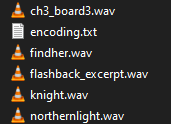
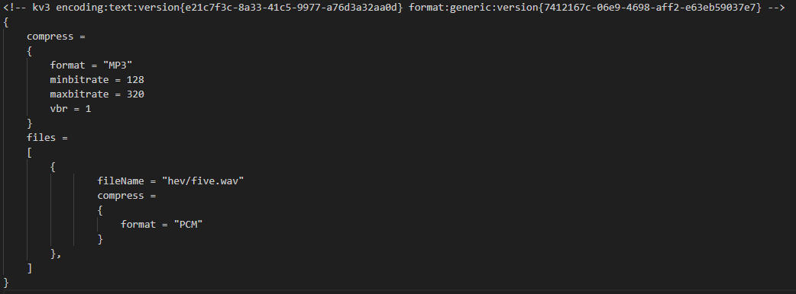

`encoding.txt` is a file that controls sound compile parameters, like compression, loop points, sample rate, normalization and etc. 

## How to use
Download `lame_enc.dll` from the [LAME](https://www.rarewares.org/mp3-lame-bundle.php) site and drop it into the `game/bin/win64` folder of your game. Then create a `encoding.txt` file in the directory of your `.WAV` sound.

 

:::warning
`encoding.txt` only works with sound files of the `.WAV` format.
:::

## Making looping sounds

To make looping sounds, create a `encoding.txt` in a directory where your sounds are located.

 

Then, you must have a `files` vector like this present in your file.

```cpp
<!-- kv3 encoding:text:version{e21c7f3c-8a33-41c5-9977-a76d3a32aa0d} format:generic:version{7412167c-06e9-4698-aff2-e63eb59037e7} -->
{
        files =
	[
		{
				fileName = "soundname1.wav"
				loop =
				{	
					loop_start_time = 0
					loop_end_time =  11.428526
				}				
		},
	
		{
				fileName = "soundname3.wav"
				loop =
				{	
					loop_start_sample = 443016
					loop_end_sample =  3810374
                                        crossfade_ms = 1
				}
		},
	]
}
```
Near the filename of your sound, have a `loop` block with either `loop_start_time/loop_end_time` in seconds defined, or `loop_start_sample/loop_end_sample` in audio sample time.

## Applying global compression

To compress all `.wav` files in your addon enmasse to keep the compiled sound filesize low, you can create a `encoding.txt` with these parameters in `content/sounds` directory:

```cpp
<!-- kv3 encoding:text:version{e21c7f3c-8a33-41c5-9977-a76d3a32aa0d} format:generic:version{7412167c-06e9-4698-aff2-e63eb59037e7} -->
{
	compress = 
	{
		format = "mp3"
		minbitrate = 128
		maxbitrate = 320
		vbr = 1
	}
}
```
To override the compression settings per-directory, a new `encoding.txt` with different parameters can be created in a directory closest to your sounds.

 

To change the compression settings on per-file basis, a `files` vector like this must be present in your `encoding.txt` file.

 


## encoding.txt file

```cpp
<!-- kv3 encoding:text:version{e21c7f3c-8a33-41c5-9977-a76d3a32aa0d} format:generic:version{7412167c-06e9-4698-aff2-e63eb59037e7} -->
{
	compress = 
	{
		format = "mp3"
		minbitrate = 128
		maxbitrate = 320
		vbr = 1
	}
        files =
	[
		{
				fileName = "soundname1.wav"
				loop =
				{	
					loop_start_time = 0
					loop_end_time =  11.428526
				}
				resample =
				{
					rate = 44100
				}
		},

		{
				fileName = "soundname2.wav"
				loop =
				{	
					loop_start_time = 0
					loop_end_time =  32
				}
                                compress = 
                                {
                                        format = "PCM" // Set format to PCM to disable compression.
                                }
		},

		{
				fileName = "soundname3.wav"
				loop =
				{	
					loop_start_sample = 443016
					loop_end_sample =  3810374
                                        crossfade_ms = 1
				}
		},
	]
}
```

## encoding.txt Parameters

### files
#### filename
Can be used to define unique behavior per-soundfile in a directory with multiple of them.

### compress
#### format
Can be either `pcm` or `mp3`.
#### vbr
Enable Variable Bitrate.
#### vbrquality
Set VBR Quality.
#### maxbitrate
Set Maximum Bitrate.
#### minbitrate
Set Minimum Bitrate.
#### quality
Set Quality.
#### bitrate
Explicitly set a bitrate.

### resample
#### rate_max
Set Maximum Sample Rate.
#### rate_min
Set Minimum Sample Rate.
#### rate
Explicitly set a Sample Rate.

### loop
#### loop_disable_markers
Disable existing loop markers present on the `.wav` file.
#### loop_start_time
Set Loop Start Time in seconds.
#### loop_end_time
Set Loop End Time in seconds.
#### loop_start_sample
Set Loop Start Time in Audio Sample Time.
#### loop_end_sample
Set Loop End Time in Audio Sample Time.
#### crossfade_ms
Set crossfade between loop transition in miliseconds.

### normalize
#### level
#### compressorRatio
#### compressorHeadroom
#### compressorAttackMS
#### compressorReleaseMS
#### compressorLookaheadMS
#### limiterAttackMS
#### limiterReleaseMS
#### limiterLookaheadMS
#### removeDC
#### mode
Can be either `peak` or `RMS`.

