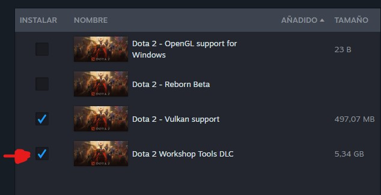
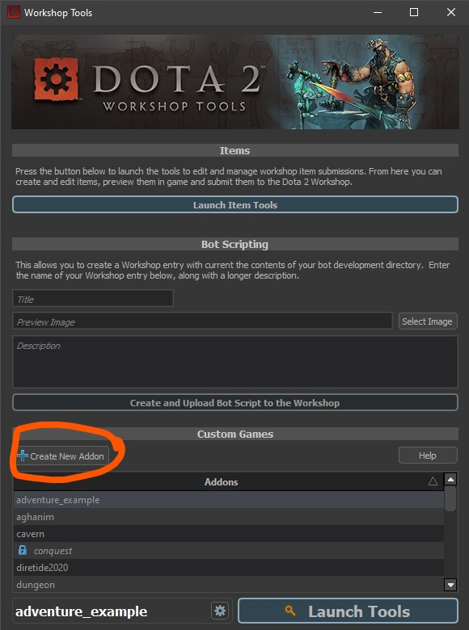
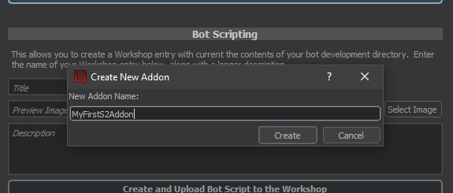
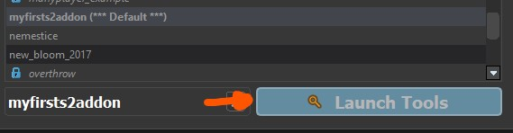

This guide explains how to install and launch the Source 2 Workshop Tools.

Each Source 2 game provides a DLC package that contains the tools required to create custom content. These tools are distributed separately from the main game.  
:::info
<Game name="steamvr"/> is the exception. Its tools are included with the game by default and can be found in:  
`SteamDir\SteamVR\tools\steamvr_environments\game\bin\win64`
:::

# Installation
1. Open your Source 2 game in the **Steam Library**.  
2. Scroll down to the **DLC** section.  
3. Locate the entry labeled **Workshop Tools** and install it.  

  
  

# Launching the Workshop Tools
After installation, the tools can be accessed through the **Addon Launcher**. To open it:  

1. Launch your Source 2 game from Steam.  
2. In the startup menu, select **Tools**.  

:::info
The Addon Launcher can also be started directly from the installation directory:  
`bin/win64\nameofyourgamecfg.exe`  

Examples: `dota2cfg.exe`, `hlvrcfg.exe`, `steamvrcfg.exe`
:::

  

Although each Source 2 game has its own Addon Launcher, the workflow is the same:  
- Create a new addon.  
- Open the Workshop Tools.  

  
  

