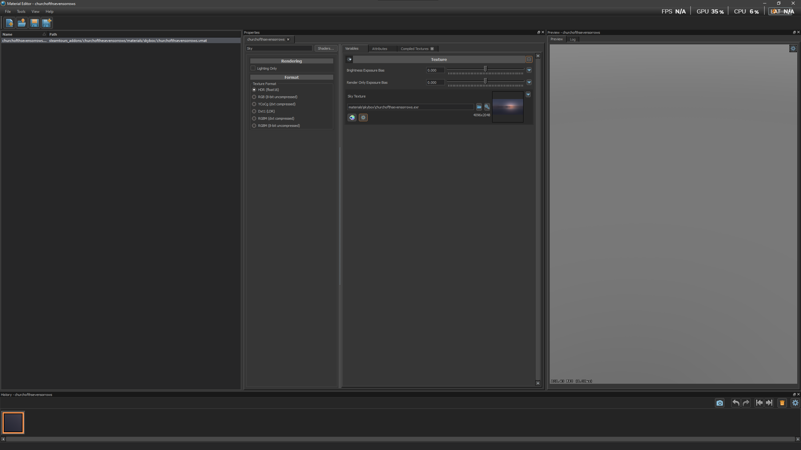
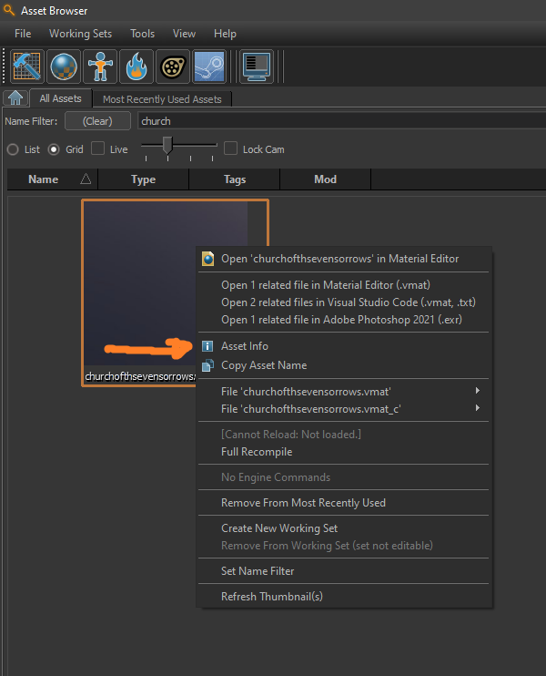
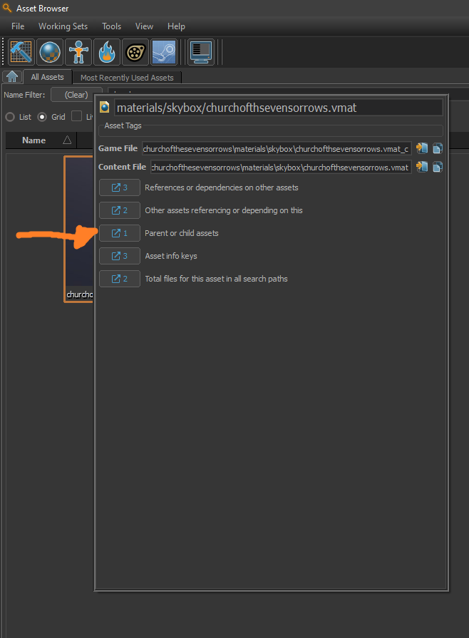
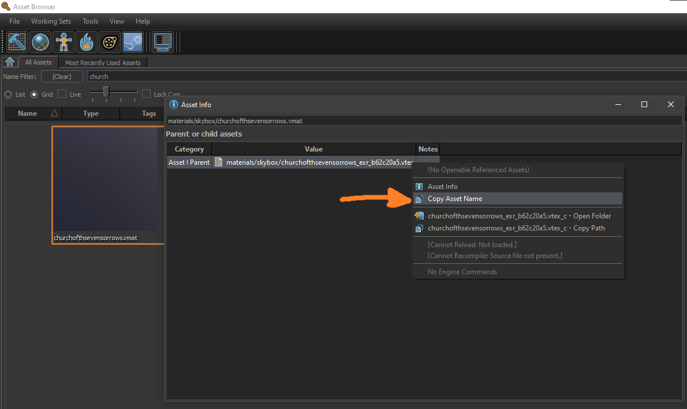
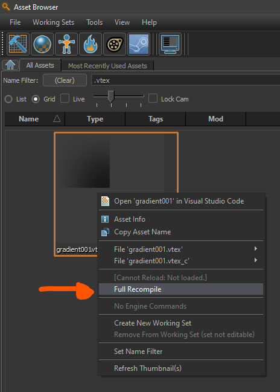
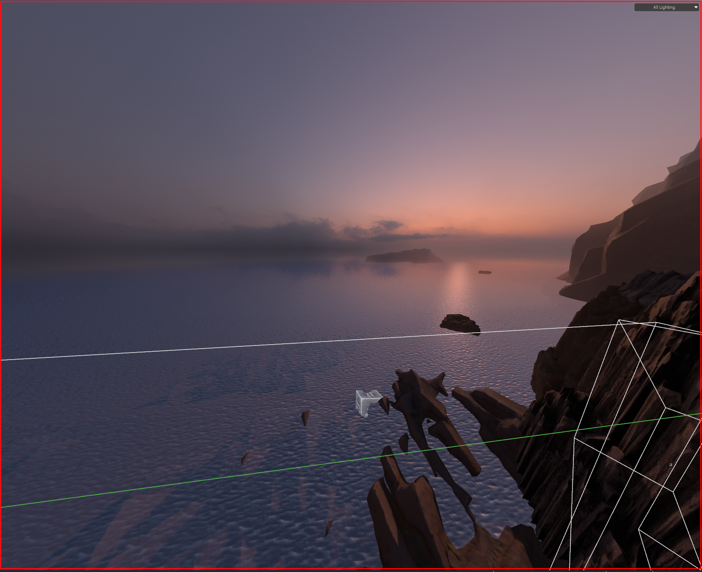

This guide explains how to create a functional **env_cubemap_fog** in older Source 2 games. This applies to <Game name="hla"/> and <Game name="steamvr"/>.

:::warning
For <Game name="steamvr"/>, Method 1 is the way to go, since **resourcecompiler** has a bug where **.vtex** files, regardless of their settings, do not generate **mipmaps**, which are required for **env_cubemap_fog** to work properly.
:::

## Method 1
:::info
If you change the texture in **MaterialEditor**, a new **.vtex** file will be generated, so you will need to set the new **.vtex** file again in the **env_cubemap_fog** entity in Hammer.
:::

1. Create your **2D skybox** in **MaterialEditor**.  


2. Go to the **AssetBrowser** and search for your **2D skybox** material. **Right-click**, then **left-click** on **Asset Info**, then **left-click** on **Parent or Child assets**, and copy the asset name.  
  
  


3. Finally, copy the compiled asset name into the **env_cubemap_fog** entity in Hammer.  


## Method 2

1. Create a **.vtex** file and set the  
   ``"m_fileName" "string" "name_of_your_texture"``  
   to the relative path of your **2D skybox texture**.

:::info
Your ``"m_outputFormat" "string" "compression_format"`` should always be ``BC7`` (HDR block compression) or ``BC6H`` (high‑quality RGB or RGBA block compression), since skyboxes are normally 16‑bit or 32‑bit images.
:::

```
<!-- dmx encoding keyvalues2_noids 1 format vtex 1 -->
"CDmeVtex"
{
    "m_inputTextureArray" "element_array" 
    [
        "CDmeInputTexture"
        {
            "m_name" "string" "InputTexture0"
            "m_fileName" "string" "materials/my_textures/my_texture.png"    // Replace this string
            "m_colorSpace" "string" "srgb"
            "m_typeString" "string" "2D"
            "m_imageProcessorArray" "element_array" 
            [
                "CDmeImageProcessor"
                {
                    "m_algorithm" "string" "None"
                    "m_stringArg" "string" ""
                    "m_vFloat4Arg" "vector4" "0 0 0 0"
                }
            ]
        }
    ]
    "m_outputTypeString" "string" "2D"
    "m_outputFormat" "string" "BC7"
    "m_outputClearColor" "vector4" "0 0 0 0"
    "m_nOutputMinDimension" "int" "0"
    "m_nOutputMaxDimension" "int" "0"
    "m_textureOutputChannelArray" "element_array" 
    [
        "CDmeTextureOutputChannel"
        {
            "m_inputTextureArray" "string_array" [ "InputTexture0" ]
            "m_srcChannels" "string" "rgba"
            "m_dstChannels" "string" "rgba"
            "m_mipAlgorithm" "CDmeImageProcessor"
            {
                "m_algorithm" "string" "Box"
                "m_stringArg" "string" ""
                "m_vFloat4Arg" "vector4" "0 0 0 0"
            }
            "m_outputColorSpace" "string" "srgb"
        }
    ]
    "m_vClamp" "vector3" "0 0 0"
    "m_bNoLod" "bool" "0"
}
```

2. Compile your material. This is done automatically. If not, go to the **Asset Browser**, search for your texture, **right‑click**, and select **Full Recompile**.  


3. Finally, copy the compiled asset name into the **env_cubemap_fog** entity in Hammer.

## Which method is better?

It depends on your case. If your skybox has no modifications in **MaterialEditor**—such as brightness or exposure—then **Method 2** is the better option, since it allows more control over the texture if you need to adjust lighting, resolution, etc.

Usually, you won’t need such tweaks, so **Method 1** is recommended, and it is also more efficient since you only need one texture.

## Preview in **Hammer**

