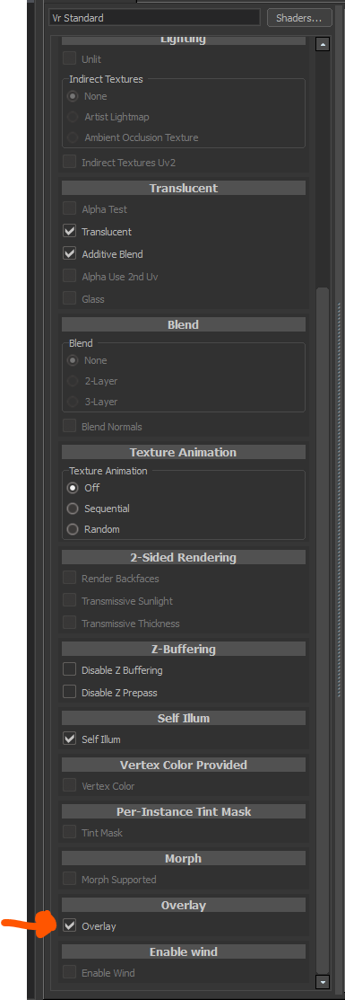
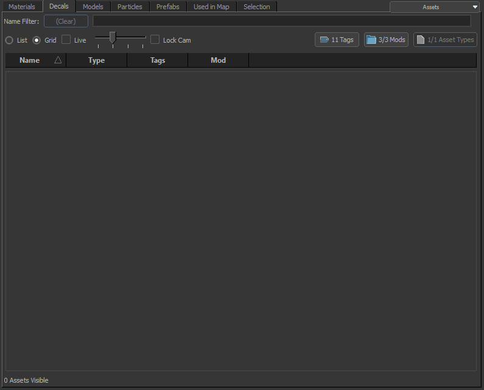
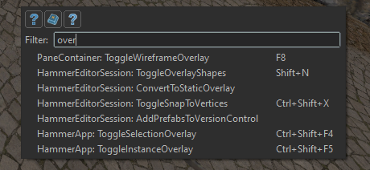
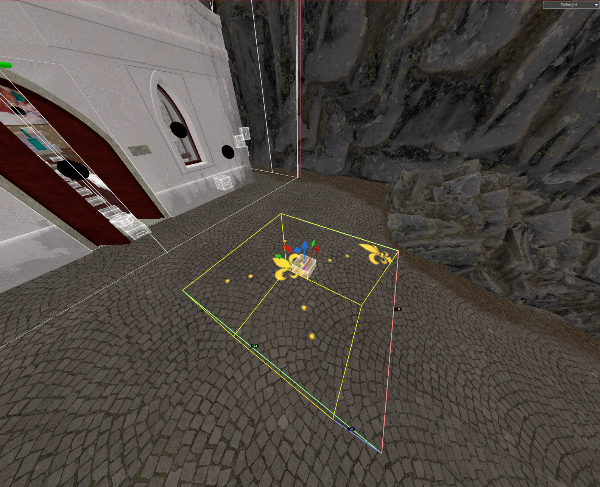

## Creating the overlay material
1. Create a new material and set the shader to **VR Standard**.  
  

2. Scroll down until you see a check box called **Overlay**, then enable it.  
  

## Creating the overlay in Hammer

### Method 1
Unlike <Game name="hla"/> or <Game name="cs2"/>, <Game name="steamvr"/> has no **Overlay** window in the **Hammer Asset Browser**, so you cannot drag and drop the material into the scene.

<Game name="steamvr"/> **Hammer Asset Browser**

  

To avoid this, select the material in the **Material** window of the **Hammer Asset Browser** and drag the material from the **Active Material** window.  

:::info
In case **Hammer** does not show the **Asset Browser**, just change the viewport.

    

        <video width="100%" controls>
            <source src="/video/steamvroverlay_assetbsr.mp4" type="video/mp4" />
            Your browser does not support the video tag.
        </video>
    

:::

    <video width="100%" controls>
        <source src="/video/steamvroverlay.mp4" type="video/mp4" />
        Your browser does not support the video tag.
    </video>

---

### Method 2
1. Create a **Quad** and apply the overlay material.  
  
  

2. Press **F1**, type **ConvertToStaticOverlay**, and press **Enter**.  
  
  
