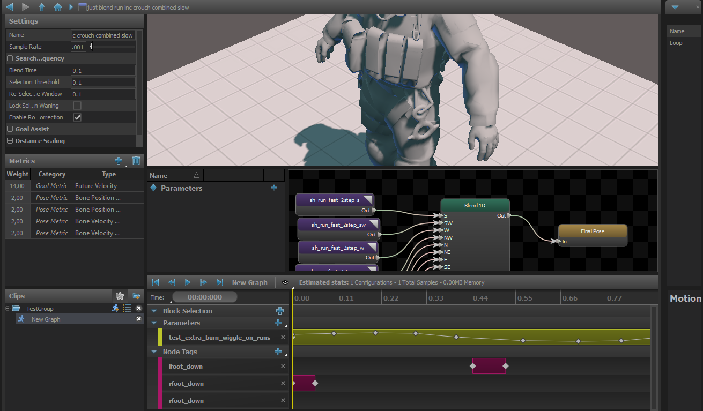

Motion Matching

Continuously picks the best clip of animation to play from a given set of animations based on a defined set of cost metrics.

## Clips
For Motion Matching Clips, not only an amount of clips based on cost metrics controlled with parameters can be selected, but also a Motion Graph can be used.
Motion Graph can use clips and a 1D Blend that uses the Motion Graph Parameter. More samples are defined, more your motion matching node and graph become expensive.

## Core parameters

### Sample Rate
When the Sampling method is set to Uniform, each clip in the motion set is sampled at this rate to determine the list of possible entry points into the clip that will be included in the motion search.
## Search Every Update
## Blend Time
The amount of time to take to blend to a new clip/entry point once its chosen.
## Selection Threshold
Any new selection must exceed the score of the current clip by this amount to be chosen as the new clip.
## Re-Selection Time Window
This setting controls how much time before and after the current clip's cycle is off limits for new selections.  

Sometimes the motion matching search will find that the best new sample the jump to is really close to the current time of the current clip, which cause the motion to appear to stutter and get stuck in short loops.

To prevent this, the system prevents new selections from samples within a user-defined window of time around the current selection.
## Lock Selection When Waning
When true, the selection will not get updated while this node is being blended out of (aka: \"Waning\")
## Enable Rotation Correction
## Enable Goal Assist
Toggles Goal Assist on and off.

Goal Assist will force the motion matching system to pick a new clip if the entity is near the goal waypoint but the currently selected clip won't move the entity far enough to reach the goal.  Helps avoid premature stops.
## Enable Distance Scaling
Toggles Distance Scaling on and off.

If the current clip is not a looping animation, Distance Scaling helps the the clip stop exactly at the goal at the end of the path by scaling the root motion of the clip.

## Motion Matching Metrics

### Bone Position Metric
### Bone Velocity Metric
Search metric that compares the current velocity of a bone on the entity to the velocity of that bone in the clips.
### Current Rotation Velocity Metric
### Current Velocity Metric
### Distance Remaining Metric
Search for clips that match the distance remaining along the path.
#### Maximum Tracked Distance
Clip samples that have more than this distance remaining before the end of the clip will have the value capped.  That way all samples with this distance or greater are weighted equally in the search.
#### Filter By Fixed Distance
Enable this option to filter out any samples that have less than a certain amount of movement left in the clip.
#### Min Distance
The threshhold for the fixed distance filter
#### Filter By Goal Distance
Toggle whether or not to filter out any samples that would not take the entity far enough to reach the goal
#### Goal Filter Start Distance
Don't start filtering clips until the entity is at least this distance from the goal
#### Filter By Goal Overshoot
Enable this option to filter out samples that would take the entity past its goal
#### Max Goal Overshoot Scale
Applies a scale to the goal distance that is used to filter by goal overshoot.  Using a scale rather than an absolute value allows the filter be become more aggressive as the entity gets closer to the goal.
### Foot Cycle Metric
Search for clips where the foot cycle matches the entity's current foot cycle.
#### Foot
List of the feet to include in the search
### Foot Position Metric
Match the current position of the entity's foot with the position of the foot at the start of the clip samples.  Only works if feet are defined on the model and the graph is using the Strider system.
#### Foot
The feet positions to check
#### Ignore Slope
The Strider system supports traversing uneven terrain so the current position of the feet may be raised if the character is standing on a slope.  This can create bad matches if the data set consists of only flat-ground animations.  So this option will adjust the position of the feet to where they would be if the entity was standing on flat ground before performing the search.
### Future Facing Metric
Compares the desired future orientation of the entity with the orientation that each clip sample would rotate the entity to after it has traveled a given distance.
#### Distance
When calculating the future facing value for each sample, advance the animation until the entity has moved this far and use the value at this point.
#### Time
### Future Velocity Metric
Compares the desired future velocity of the entity with the velocity of each clip sample after it has traveled a given distance.
#### Distance
When calculating the future facing value for each sample, advance the animation until the entity has moved this far and use the value at this point.
#### Stopping Distance
When the entity is within this distance of the goal, ramp down the target velocity to match so that the velocity is zero at the goal.
#### Mode
- Direction Only
- Magnitude Only
- Direction and Magnitude
### Path Metric
Search for clip samples that most closely match the shape of the current path.
#### Distance
The farthest distance along the path to check.
#### Sample Times
These items are the samples along the path, defined by their distance from the entity's current position.  

The values are a scale applied to  Distance.  So for example if Distance is 100, and a Sample Time is 0.5, then the metric will include a check between the position 50 units along the path with the position the entity would be if it moved (up to) 50 units with each clip.
#### Extrapolate Movement
Some clips don't loop, but don't end with the entity coming to a stop, either.  So when this option is enabled, the metric will guess at the future position of the entity if it were to continue in the direction and speed at the end of the clip, and use those extrapolated values when calculating the samples of the clip.
#### Min Extrapolation Speed
Some animation clips actually DO bring the entity to a stop, but the velocity on the last frame isn't quite zero.  So this value allows you to specify a minimum speed that the entity needs to be moving at the end of a clip for this metric to do any extrapolation of the future position.

