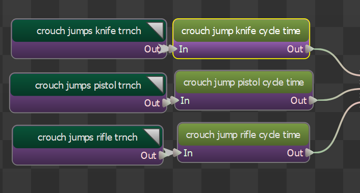
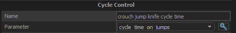

Cycle Control node allows the cycle of an animation defined to be controlled by a defined float parameter.

## Parameters
The parameter to use to control the cycle of the child node.  Only supports Float parameters.