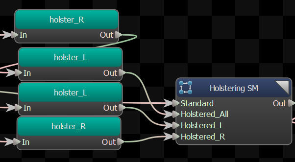
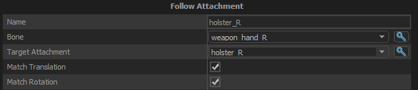

Procedurally move a bone to match to position and/or rotation of a target Attachment.

## Bone
The bone to modify.

## Target Attachment
The attachment that the selected bone should follow.

## Match Translation
When selected, will cause the position of the selected bone to match the position of the attachment.

## Match Rotation
When selected, will cause the rotation of the selected bone to match the rotation of the attachment.