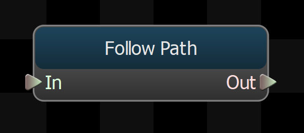
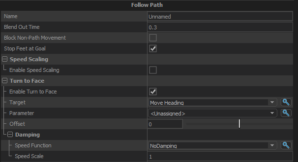

Takes the root motion from its children and modifies it to move along the path, while also turning the character's body to face a desired direction.

Also updates the predicted foot position to be along the path.

This node provides an optional Goal Pose input connection, which should be to a stationary animation.  If a node is connected to this input, the foot motion calculated by this node will be modified as the character gets closer to the goal, so that when it stops its feet will be in the right place for the goal pose animation.

## Blend Out Time
If the path goes away while this node is active (either from reaching the goal or being cancelled), this value is the amount of time to blend out any modifications this node is making to the path motion and the predicted foot positions.
## Block Non-Path Movement
If the character does not have a path, then all root motion translation from this node's children will be blocked when this option is enabled.  Rotation from child nodes will not be affected.
## Stop Feet at Goal
When enable, this node will adjust the predicted positions of the feet so that they do not go past where they would be if the character was standing at the goal.
## Speed Scaling
### Enable Speed Scaling
Turns on Speed Scaling.
Speed scaling reduces the speed of the root motion if it is not going in the same direction as the path.  This can sometimes help prevent foot locking from trying to step farther than looks natural.
## Turn To Face
### Enable Turn To Face
When enabled this node will procedurally generate root motion to turn the character to face a given direction.
### Target
The direction (if any) that the character's body should be turned towards as they walk the path.
### Parameter
Use a float parameter instead of Target.
### Turn to Face Offset
Apply an offset angle to the <em>Turn to Face</em> direction, so that the character can, for example, face away from the target direction.
### Stopping Distance
If the node has a Goal Pose set, it will start blending the foot motion to use the stance positions of the goal pose when it is <em>Stopping Distance</em> from the goal.
### Blend Animation
When enabled, this node will blend the skeletal animation from the default input animation to the goal pose animation as the character approaches the goal.  The foot motion will still come from the default animation though so the stride will not be interrupted.
## Damping

Controls the speed with which the character's body is turned toward the <em>Turn to Face</em> direction.

### Speed Function
Controls how damped speed is adjusted based on how far the current value is from the target value. 
- <b>No Damping:</b> Damping is not applied.  
- <b>Constant:</b> The damping speed does not change with distance from the target value.  
- <b>Spring:</b> A critically damped spring is used to accelerate the current value toward the target value.  The farther the current value is from the target, the more the acceleration.  However the spring will not overshoot the target value.  
- <b>Asymmetric Spring</b>
### Speed Scale
Scales the speed of the damping, or in the case of the Spring <b>Speed Function</b> it controls the strength of the spring.
### Speed Scale (Falling)
When using AsymmetricSpring for <b>Speed Function</b> it controls the strength of the spring, only when damping to a lower value.
### Limit Speed
Toggle whether or not to clamp the damping speed
### Min Speed
If <b>Limit Speed </b>is set, this is the slowest speed that the dampened value can change at.
### Max Speed
If <b>Limit Speed </b>is set, this is the fastest speed that the dampened value can change at.

