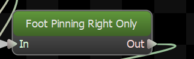
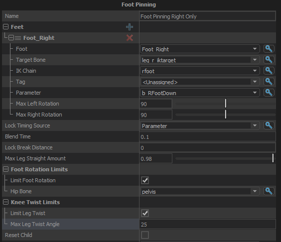

This node is responsible for foot pinning.

## Feet
List of the feet that this node should control.  The feet of the character are defined on the model using the Feet node in modeldoc.
### Foot
Which foot definition (as defined on the model) to calculate foot pinning for.
### Target Bone
The bone on the model that this node will position to where the foot should be.  
This bone should not be on the leg, but instead should be an IK target bone that is a child of the root.
### IK Chain
Name of the chain of bones to modify to move the foot to the calculated position.  IK Chains are defined on the model in ModelDoc.
### Tag
Tag to fire when the trigger criteria are met.
### Parameter
Parameter to fire when the trigger criteria are met.
### Max Left Rotation
The maximum angle (in degress) that this foot can be rotated to the left, relative to the character's forward direction.  Beyond this angle the foot will rotate about the ball of the foot.
### Max Right Rotation
The maximum angle (in degress) that this foot can be rotated to the right, relative to the character's forward direction.  Beyond this angle the foot will rotate about the ball of the foot.
## Lock Timing Source
What will be the timing source for foot locking. Foot Motion, Tag or a Parameter.
## Blend Time
The amount of time to blend from the IK'd position to the animated position and back when the lock is broken or re-engaged.
## Lock Break Distance
## Max Leg Straight Amount
## Foot Rotation Limits
### Limit Foot Rotation
Enable/Disable limits on how far the feet can rotate relative to the hip bone.  The angles of the limits are defined in the per-foot settings (Max Right/Left Rotation).
### Hip Bone
Specify the name of the character's hip bone to allow this node to adjust the character's height as they are stepping up and down uneven terrain.  This same bone is also used for tilting the character on slopes if <em>Apply Tilt</em> is enabled.
## Knee Twist Limits
### Limit Leg Twist
When enabled, the IK will rotate the leg so that the knee and foot are pointing the same direction within a given tolerance.  Prevents the ankle looking broken.
### Max Leg Twist Angle
The maximum amount the direction of the foot and the direction of the knee can deviate when \"Limit Leg Twist\" is enabled.
## Reset Child
When enabled, the child node will get reset when this node is.  Otherwise resets will not be forwarded to the child node.