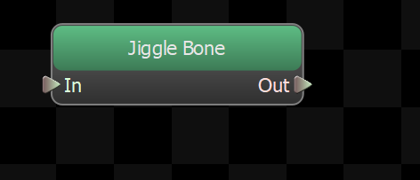
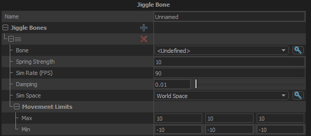

Procedurally animates a bone or bones as if they are attached to their animated position by a spring.
Networking is not used for this node, the spring simulation is performed locally on both the server and the client.

## Jiggle Bones
List of bones to simulate.  Note that each bone is simulated independently, and they do not affect each other directly.
### Bone
The bone to simulate.
### Spring Strength
A scale of the force that pulls the bone to its animated position.
### Sim Rate (FPS)
The rate at which the simulation is run, in frames per second.  If the graph update is longer than this time, multiple sub-step simulations are performed.  If the graph update is shorter than this then the sim will use a single step with the same time delta as the graph.
### Damping
The rate at which the motion stabilizes.  The value represents the amount of energy removed from the simulation each update.
### Sim Space
The coordinate system the simulation is performed in.  Use the to control how much motion the bone inherit from the movement of the character.  

- <b>Local Space:</b> The sim is performed in the bone's local space.  Only the animation on the bone itself will affect the simulation
- <b>Model Space:</b> Sim is performed in the coordinate space of the model.  The character's full body animation will affect the simulation, but its movement through the world will not 
- <b>World Space:</b> Sim is performed in world space.  All motion of the characer will affect the simulation
### Movement Limits
#### Movement Limit Max
The farthest that the simulation can move the bone from its animated position in each axis.
#### Movement Limit Min
The farthest that the simulation can move the bone from its animated position in each axis.
