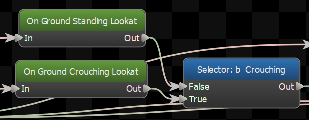
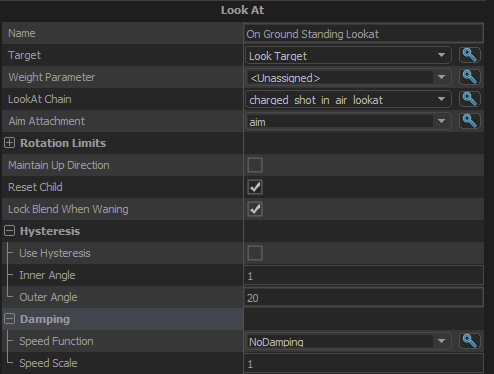

Procedurally rotate a chain of bones to face a certain direction.

## Target
What the lookAt node should aim at.  Can be a direction or a location
## Weight Parameter
<b>(Optional)</b>

Set a float parameter to control the blend weight of the lookat

## LookAt Chain
The chain of bones that will be rotated as part of the lookat.  LookAt Chains are defined in ModelDoc, and referenced by name here.
## Aim Attachment
The LookAt op needs to know not just what to aim <em>at</em>, but also where to aim <em>from</em>.  This field lets you pick an attachment that defines what this node considers \"forward\", and the lookat rotation will be made based on the direction to the target relative to this attachment.
## Rotation Limits
### Rotate Through Forward
When enabled, the entity will not rotate from -180 to 180 directly but instead rotate through 0 degrees (forward for the entity).  Bad for turrets, good for humans.
### Yaw Limit
The maximum angle that the lookat can turn the aim to the side.
### Pitch Limit
The maximum angle that the lookat can turn the aim up or down.
## Maintain Up Direction
Take the direction that was 'up' on the attachement before the lookat node changed the pose, and rotate the modified lookat chain so that direction is still 'up' as much as possible.
## Reset Child
If this option is checked, it will reset its child node when it gets reset by its parent. 
## Lock Blend When Waning
Don't change the look direction if this node is blending out.
## Hysteresis
### Use Hysteresis
Turns hysteresis support on and off.

Using Hysteresis on the lookat makes it act \"sticky\".  Once it has turned to look in a direction it will stay there until the target direction moves more than a certain threshold.  Once it does, it will turn to look in the new direction until it is within an inner threshold.
### Inner Angle
Once the lookat starts turning towards the target direction, it will keep turning towards the target until the target is within this angle.  For best results this should be less than <b>Outer Angle</b>
### Outer Angle
If the lookat is at rest, the target direction must be more than this threshold in order for the lookat to start turning to face the target direction.  To get the best results this should be more than <b>Inner Angle</b>.

## Damping

Settings for damping the motion of the blended aim over time

### Speed Function
Controls how damped speed is adjusted based on how far the current value is from the target value. 
- <b>No Damping:</b> Damping is not applied.  
- <b>Constant:</b> The damping speed does not change with distance from the target value.  
- <b>Spring:</b> A critically damped spring is used to accelerate the current value toward the target value.  The farther the current value is from the target, the more the acceleration.  However the spring will not overshoot the target value.  
- <b>Asymmetric Spring</b>
### Speed Scale
Scales the speed of the damping, or in the case of the Spring <b>Speed Function</b> it controls the strength of the spring.
### Speed Scale (Falling)
When using AsymmetricSpring for <b>Speed Function</b> it controls the strength of the spring, only when damping to a lower value.
### Limit Speed
Toggle whether or not to clamp the damping speed
### Min Speed
If <b>Limit Speed </b>is set, this is the slowest speed that the dampened value can change at.
### Max Speed
If <b>Limit Speed </b>is set, this is the fastest speed that the dampened value can change at.

