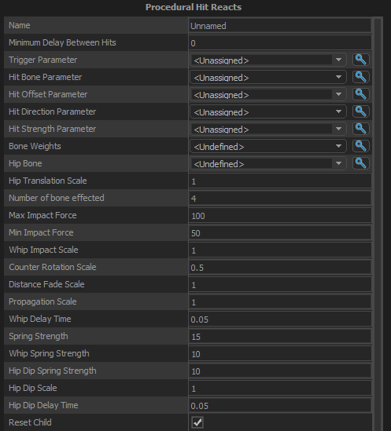

Applies a procedurally-generated hit reaction on top of a given pose.  Takes hit location, direction, and force into account.
 
 
Generally it works like this:
- The bones below the point of impact rotate in the direction of the impact based on the amount of force, and will return to normal based on spring settings 
- The bones above the point of impact counter-rotate in the direction of the impact, so the hit bone appears to cave inward. They will then return to normal after a delay based on a separate spring value (Whip) 
- The hip bone will be translated in the direction of the force and then return
- The hip bone will move downward and back (Hip Dip) 

## Minimum Delay Between hits
## Trigger Parameter
The bool parameter to use to trigger a hit reaction.  Should be set to auto-reset and NOT networked.
## Hit Bone Parameter
The parameter that the game will set to the index of the bone whose physics hull got hit.  This should be an Int parameter, with the <b>Max Value</b> at least as big as the number of bones in the skeleton, and <b>Network</b> and <b>Force Latest Value</b> set to True.

Note that the game code expects this parameter's name to be i_Hit_Bone.
## Hit Offset Parameter
The parameter that the game code should set the offset of the point of impact from the hit bone in the hit bone's local space.  Should have <b>Network</b> and <b>Force Latest Value</b> set to True.

Game code expects this variable to be set to v_Hit_Offset.
## Hit Direction Parameter
The parameter that the game code should set to be the world-space direction the object that hit the character was moving on impact.  Should have <b>Network</b> and <b>Force Latest Value</b> set to True.

Game code expects this parameter to be named v_Hit_Direction
## Hit Strength Parameter
The parameter that the game code should set to the strength with which the character was hit.  Should have <b>Network</b> and <b>Force Latest Value</b> set to True.

Game code expects this parameter to be named f_Hit_Strength
## Bone Weights
(Optional) Set this value to a weight list to define how much each bone can be effected by a hit reaction.
## Hip Bone
The bone close to the root of the character that will get translated by impacts and will have the hip dip applied to it.
## Hip Translation Scale
Scales the amount that the hips are translated based on the strength of the impact.
## Number of bones affected
The bones that get rotated as part of the hit reaction are this number of bones away from the hit bone.
## Max Impact Force
The largest amount of force that can be applied from an impact.
## Min Impact Force
The smallest amount of force that can be applied from an impact.
## Whip Impact Scale
This value scales to the amount of force that gets applied to the children of the hit bone.  So a value less than 1 will cause the child bones to be pushed back less by each hit.
## Counter Rotation Scale
The child bones of the hit bone will counter-rotate to offset the impact rotation of the parent bones, making the bone chain appear to bend inward at the point of impact.  This value will allow you to scale how much of the counter-rotation to apply.
## Distance Fade Scale
How much to reduce the force of the impact on bones based on how far they are from the point of impact.
## Propagation Scale
Scales the impact force by this amount for each bone based on how many bones it is away from the hit bone.
## Whip Delay Time
Amount of time to delay moving the child bones of the hit bone back into place after they have finished moving in the direction of the impact.
## Spring Strength
How strongly the hit bone and its parents should resist the force of the impact.  Higher values will cause the bones to move less and return to their normal position faster.
## Whip Spring Strength
How strongly the children of the hit bone should resist the force of the impact.  Higher values will cause the bones to move less and return to their normal position faster.
## Hip Dip Spring Strength
How strongly the hip should resist the force of the impact.  Higher values will cause it to move less and return to its normal position faster.
## Hip Dip Scale
Scales the amount of the impact force that effects the hip dip.
## Hip Dip Delay Time
Number of seconds to wait before the hip dip movement starts.
## Reset Child
Whether or not the child of this node should get reset when it does.