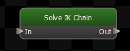
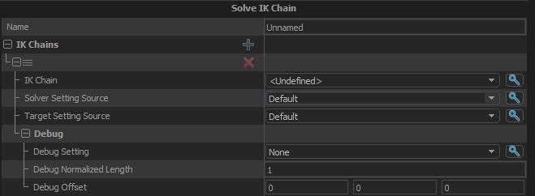

Solve an IK chain using either default settings or an override.

## IK Chains
IK Chains to solve.
### IK Chain
The chain of bones to perform the IK solve on. Defined in ModelDoc.
### Solver Setting Source
Use the default solver setting or override.
#### Override Solver Settings
##### Solver Type
The IK solver to use to solve the IK chain defined.  Use Two Bone unless you have a good reason not to.
### Target Setting Source
Use the default target setting or override.
#### Override Target Settings
##### Target Source
The IK target source defined. Can be either the bone, Animgraph Position Parameter or IKTARGETSOURCE_COUNT.
### Debug
#### Debug Setting
#### Debug Normalized Length
#### Debug Offset
