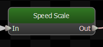

Allows a parameter to directly control the playback speed of its child.  

Note that playback speed is inherited: if a node tells its child to play at half speed, and that child node tells its child to play at half speed, then the last child will play at quarter speed.

## Parameter
The parameter used to control the speed.  Only Float Parameters are supported.