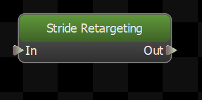
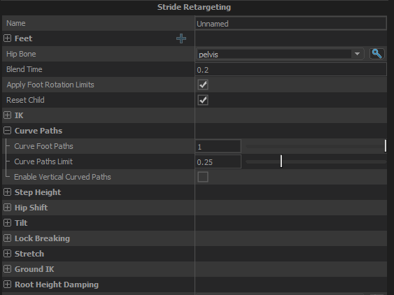

Uses the blended foot cycles of the child nodes to lock the feet in place when they are on the ground, and guide them to the predicted next step position when they are in the air.  The results are set on a user-defined bone for each foot, which should be used as the IK target for the leg.

## Feet
List of the feet that this node should control.  The feet of the character are defined on the model using the Feet node in Modeldoc.
### Foot
Which foot definition (as defined on the model) to calculate procedural motion for.
### Target Bone
The bone on the model that this node will position to where the foot should be.
This bone should not be on the leg, but instead should be an IK target bone that is a child of the root.
### IK Chain
Name of the chain of bones to modify to move the foot to the calculated position.  IK Chains are defined on the model in ModelDoc.
### Disable Tag
<b>(Optional)</b> Specify a tag that, when active, will disable the procedural foot planting calculations for this foot.
### Max Left Rotation
The maximum angle (in degress) that this foot can be rotated to the left, relative to the character's forward direction.  Beyond this angle the foot will rotate about the ball of the foot.
### Max Right Rotation
The maximum angle (in degress) that this foot can be rotated to the right, relative to the character's forward direction.  Beyond this angle the foot will rotate about the ball of the foot.
### Footstep Landed Tag
Tag that works with the Strider system to automatically emit footstep sounds when the feet hit the ground.
## Hip Bone
Specify the name of the character's hip bone to allow this node to adjust the character's height as they are stepping up and down uneven terrain.  This same bone is also used for tilting the character on slopes if <em>Apply Tilt</em> is enabled.
## Blend Time
The amount of time to smooth over transitions and also to blend to the parked foot position.
## Apply Foot Rotation Limits
When enabled, the amount that the feet can be turned relative to the characters forward direction will be limited to be within the angle specified on each foot.
## Reset Child
When enabled, the child node will get reset when this node is.  Otherwise resets will not be forwarded to the child node.
## IK
### IK Solver Type
The IK solver to use to solve the IK chain defined for each foot.  Use Two Bone unless you have a good reason not to.
### Always use fallback hinge
Force the IK solver to always use the axis of rotation for the knee that is defined as part of the IK Chain in Modeldoc.  When not enabled, the IK solver will try to deduce the axis of rotation based on how the animation has rotated the joints, and only used the fallback hinge when the joints are perfectly straight.  This is useful in case some of the animation data hasn't been cleaned and the knees hyperextend
### Limit Leg Twist
When enabled, the IK will rotate the leg so that the knee and foot are pointing the same direction within a given tolerance.  Prevents the ankle looking broken.
### Max Leg Twist Angle
The maximum amount the direction of the foot and the direction of the knee can deviate when \"Limit Leg Twist\" is enabled. 
## Curve Paths
### Curve Foot Paths
Moving the foot in a straight line from its previous step position to the next can produce unnatural looking movement, and potentially make the legs pass through each other.  A more natural stride tends to curve the foot through its stance position half way through.  This value lets you control how much the foot should curve through the stance position during a step.
### Curve Paths Limit
Puts a limit on the maximim distance that the curved path can take the foot from the straight-line path, as a percentage of the length of the stride.  ie: if the step is short, the displacement of the curve should also be short.
### Enable Vertical Paths
Experimental: use with caution

Arcs the path of the foot vertically based on the difference in height and surface normal of the previous and next foot positions.
## Step Height
### Modulate Step Height
When enabled, the height of each step will be increased or decreased in proportion to how much the step length is increased or decreased compared to the original animation.
### Height Increase Scale
How much to increase the height of the foot step when the stride length is longer than the original animation.  0 means don't increase it at all, 1 means increase it proportinally to the increase in stride length. 
### Height Decrease Scale
How much to decrease the height of the foot step when the stride length is shorter than the original animation.  0 means don't decrease the height at all, 1 means decrease it proportionally to the reduction in step length.
## Hip Shift
### Enable Hip Shift
When enabled, if the positions of the feet are different than they were in the original animation then the hips will get moved by the same amount to attempt to keep the center of mass of the character in the right place.
### Hip Shift Scale
Controls how much of the hip shift to apply.
#### Damping

Provides controls to smooth out changes in the hip shift.

##### Speed Function
Controls how damped speed is adjusted based on how far the current value is from the target value. 
- <b>No Damping:</b> Damping is not applied.  
- <b>Constant:</b> The damping speed does not change with distance from the target value.  
- <b>Spring:</b> A critically damped spring is used to accelerate the current value toward the target value.  The farther the current value is from the target, the more the acceleration.  However the spring will not overshoot the target value.  
- <b>Asymmetric Spring</b>
##### Speed Scale
Scales the speed of the damping, or in the case of the Spring <b>Speed Function</b> it controls the strength of the spring.
##### Speed Scale (Falling)
When using AsymmetricSpring for <b>Speed Function</b> it controls the strength of the spring, only when damping to a lower value.
##### Limit Speed
Toggle whether or not to clamp the damping speed
##### Min Speed
If <b>Limit Speed </b>is set, this is the slowest speed that the dampened value can change at.
##### Max Speed
If <b>Limit Speed </b>is set, this is the fastest speed that the dampened value can change at.
## Tilt
### Apply Tilt
When enabled, will apply tilt to the Hip Bone based on the height of the feet due to sloped or uneven terrain.
### Tilt Plane Pitch Strength
Controls the strength of the spring that is damping the change in pitch of the tilt plane.
### Tilt Plane Roll Spring Strength
Controls the strength of the spring that is damping the change in roll of the tilt plane.
## Lock Breaking
### Enable Lock Breaking
When enabled, the system will disable the IK on a foot if its IK target is farther than it can reach, and will re-enable it when the IK target is within range again.
### Tolerance
The IK target must be more than this amount beyond the reach of the leg before the lock is broken.  Prevents the lock break engaging too frequently when the source animations start with the legs close to fully straightened.
### Blend Time
The amount of time to blend from the IK'd position to the animated position and back when the lock is broken or re-engaged.
## Stretch
### Enable Stretching
When enabled this will translate the root of the IK chain towards the IK target if the chain is not long enough to reach it on its own.  This usually means translating the hip bone; small amounts of translation are not noticable by users but it can great help to prevent the knees from locking out.
### Max Stretch Amount
The max distance that the root of the IK chain can be translated
### Extension Scale
Scales the effective length of the leg use for this effect, so that there is still some bend in the knee after it is applied.

Set this to less than 1 to have the Stretch activate before the leg is fully straight.
## Ground IK
### Enable Ground Tracing
When enabled, will cast a ray from the foot positions and move them to be on the ground
### Angle Traces with Slope
Controls the angle that the traces against the ground are cast.  
0 = Always straight down
1 = Aligned with the current slope
### Apply Hip Drop
Lower or raise the hips if necessary to allow the feet to reach their IK targets.
## Root Height Damping
### Enable Root Height Damping
The bounding box of the entity snaps to the height of the ground the entity is standing on, which can cause the height of the character to pop suddenly when going up and down stairs.  This option dampens the effective position of the character within the bounding box to smooth out these sudden changes in height.
#### Damping Settings
##### Speed Function
Controls how damped speed is adjusted based on how far the current value is from the target value. 
- <b>No Damping:</b> Damping is not applied.  
- <b>Constant:</b> The damping speed does not change with distance from the target value.  
- <b>Spring:</b> A critically damped spring is used to accelerate the current value toward the target value.  The farther the current value is from the target, the more the acceleration.  However the spring will not overshoot the target value.  
- <b>Asymmetric Spring</b>
##### Speed Scale
Scales the speed of the damping, or in the case of the Spring <b>Speed Function</b> it controls the strength of the spring.
### Max Offset
The limit on the distance that the character can be moved upwards relative to its bounding box.
### Min Offset
The limit on the distance that the character can be moved downward relative to its bounding box.

