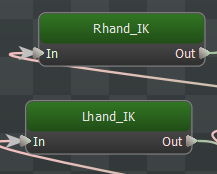
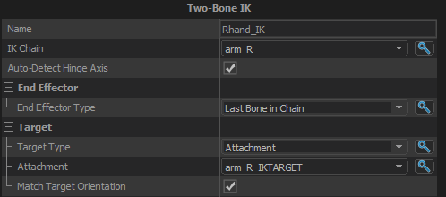

Implements a simple solver for 2 bone (plus 1 end-effector bone) inverse kinematics.  The IK chains are defined in the model editor.  The targets for the IK chain are attachments (ie: offsets from other bones in the skeleton, also defined in the model editor).

## IK Chain
The chain of bones to perform the IK solve on.
## Auto-Detect Hinge Axis
Look at the current axis of rotation of the hinge joint and use that as the axis of rotation when calculating the new pose.  Turning this off will force the IK to always use the hinge axis defined on the model.
## End Effector
### End Effector Type
Can be either an attachment or the last bone in the IK chain.
## Target
### Target Type
Can be either an attachment, bone, or a parameter in model/world space.
### Match Target Orientation
When true, the end effector bone in the IK chain will be rotated to match the orientation of the target Attachment.