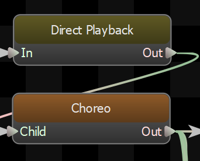

Allows game code to tell the graph the play a sequence at this point in the graph hierarchy.  This node is necessary in order to play scripted sequences.

## Finish Early
Normally when playing several scripted sequences in a row, the next sequence wont start until the current one has completely finished.  This can lead to stutters in the animation as the old sequence freezes on its last frame while the new sequence is blending in.  

Enabling this option will cause all scripted sequences on this character to be considered \"finished\" early, so that they will still be animating while they are blending out.  The Fade Out on the sequence is used to determine how early the sequence should signal that its finished.

## Reset Child On Finish
When enabled this node will reset its child node when it finishes playing an animation.
