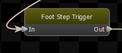
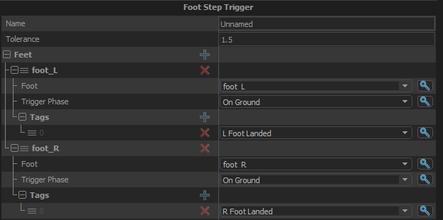

Fires tags based on the status of foot steps, using the Strider System foot step data.  Does not affect the pose of the character.

## Feet
The feet to track.
### Foot
The foot that this trigger is watching. Defined in ModelDoc.
### Trigger Phase
Choose between triggering the tag event when the foot is on the ground or in the air.
### Tags
List of tags to fire when the trigger criteria are met.