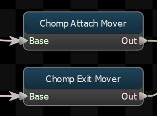
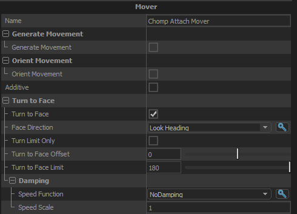

Creates root motion procedurally. 

## Generate Movement
### Generate Movement
When this option is enabled, this node will create root motion that matches the direction and speed of the \"<b>Movement Velocity Parameter</b>\" vector parameter.
### Movement Velocity Parameter
The parameter that defined the direction and speed that this node should use to generate root motion.  Must be a vector parameter, and the direction is expected to be model-relative.
## Orient Movement
### Orient Movement
When this option is enabled, this node will take the root motion generated by its child and rotate it to move the character in the direction specified by the \"<b>Movement Heading Parameter</b>\".
### Movement Heading Parameter
The parameter holding the direction that the child's root motion will be rotated towards when \"Orient Movement\" is enabled.  Must be a float parameter, and the angle is expected to be in degrees.
### Limit Turn Speed
If \"Orient Movement\" is true, this toggles whether or not rate of turn should be clamped.
### Max Turn Speed
If the rate of turn is clamped (ie: \"Limit Turn Speed\" is true), this is the speed (in degrees per second) that the turn rate will be clamped to.
## Additive
If true, the root motion generated by this node will be added to the root motion produced by its children.

If false, then the root motion from the children of this node will be ignored, and the root motion generated by this node will replace it.
## Turn to Face
### Turn to Face
Toggle whether or not the character's body should turn to face a direction.
### Face Direction
If the \"Turn to Face\" property is true, this is the direction that the character will turn towards. 
### Turn Limit Only
Don't try to turn the entity all the way to the target angle, just keep its facing with the <b>Turn to Face Limit</b> of the target angle.

## Damping

Controls how fast the character will turn when <b>Turn to Face</b> is true.  

### Speed Function
Controls how damped speed is adjusted based on how far the current value is from the target value. 
- <b>No Damping:</b> Damping is not applied.  
- <b>Constant:</b> The damping speed does not change with distance from the target value.  
- <b>Spring:</b> A critically damped spring is used to accelerate the current value toward the target value.  The farther the current value is from the target, the more the acceleration.  However the spring will not overshoot the target value.  
- <b>Asymmetric Spring</b>
### Speed Scale
Scales the speed of the damping, or in the case of the Spring <b>Speed Function</b> it controls the strength of the spring.
### Speed Scale (Falling)
When using AsymmetricSpring for <b>Speed Function</b> it controls the strength of the spring, only when damping to a lower value.
### Limit Speed
Toggle whether or not to clamp the damping speed
### Min Speed
If <b>Limit Speed </b>is set, this is the slowest speed that the dampened value can change at.
### Max Speed
If <b>Limit Speed </b>is set, this is the fastest speed that the dampened value can change at.

