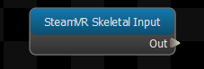
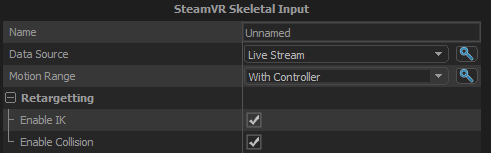

Node to read the live skeletal animation data from SteamVR and retarget it to the current skeleton.  Provides options to pass to SteamVR to control how the data stream is delivered. 

## Data Source
Which data stream should this node be pulling animation data from.  

- Live Stream: The animation stream provided by the controller that tracks the users hand
- Grip Limit: The pose of the hand when it is closed around the controller
## Hand
Choose which skeletal data stream to read from: either the right hand or the left hand.
## Additive
Choose whether the skeletal data should be delivered as delta offsets from a common \"grip limit\" pose that can be added to other animations.
## Motion Range
Choose whether SteamVR delivers the hand animation with a range of motion that matches the user's hand a closely as possible (ie: with the controller in the hand), or to convert to a full hand range of motion (as if the user was not holding a controller).  Note for some input devices, these options will be the same.
## Retargetting
### Enable IK
When this option is enabled, the retargetting logic will attempt to keep the location of the finger tips of the target skeleton at the tracked location as reported by the controller through SteamVR.
### Enable Collision
When enabled, will check for collision between the collision volumes of the fingers as defined by the SkeletalInputSettings in ModelDoc.  The retargetting system will attempt to move any colliding the fingers apart.

