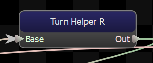
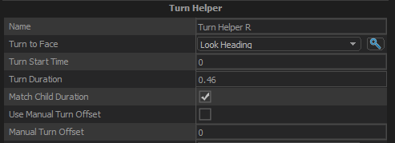

Creates additional root motion so that turn animations can be used to turn arbitrary distances.  Eg: use a 90 degree turn anim to turn 87 degrees or 102 degrees

It does this by looking at the amount of rotation that happens over the length of the child to figure out what angle the character would face with the animation alone.  Then over the course of the animation it will add or remove rotation so that when the animation is done, its facing the desired direction.

## Turn to Face
The direction that we want the character to face.
## Turn Start Time
The time (in seconds) at which this node should start applying the additional root rotation.  Try to time this with your animation to hide any foot sliding.
## Turn Duration
How long (in seconds) after the start time that this node should take to apply its extra root rotation.
## Match Child Duration
If true, this setting will override the value set in <b>Turn Duration</b> and will instead use the duration of its child.
## Clamp Turn to Child Duration
When true, this setting will clamp the Turn Duration so that the turn is finished by the time the child node has finished playing.
## Use Manual Turn Offset
When turned off, this node will calculate the amount of rotation that its child node, and then procedurally generates the rest.

When this option is on, the node will assume that the value of <b>Manual Turn Offset</b> is the amount of rotation of the child node, and will not calculate it.
## Manual Turn Offset
The amount of rotation that this node assumes the child nodes will provide.