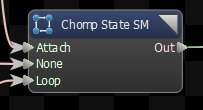
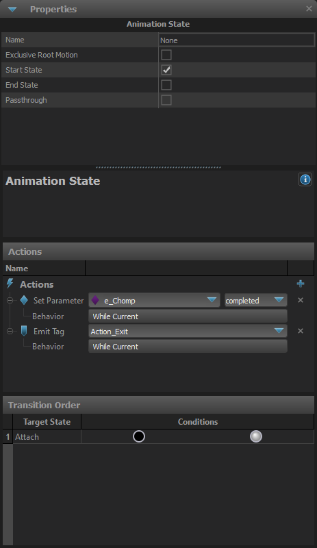
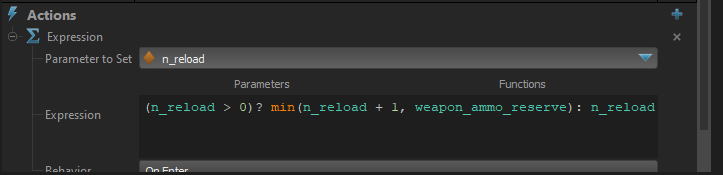
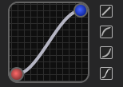
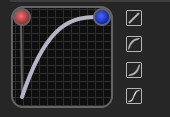
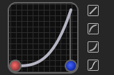

This graph node uses states, transitions, and conditions to determine which child node should be used.




## Block Tags From Waning States
When enabled, only the current state's  anim events or anim tags will be allowed through.  Events and Tags from states that are blending out (and all their children) will be blocked.
## Lock State when Waning
When enabled this will prevent the state machine from changing states if it is not part of the active branch of the graph, but is still getting updated because it is blending out.

## Animation State
The state in a state machine. Stuff can be attached to it.



### Name
The name of this state.

### Exclusive Root Motion
Normally, root motion and the animation itself is blended between the old state and the new state when a state transition occurs.  

When this option is set and this state becomes the current state, only its root motion is used, and it is not blended with the root motion of the old state, but the animation is still blended.

### Exclusive Root Motion - First Frame
Previous state root motion will be dropped even on the first frame of a transition to this state when the root motion of this state isn't available yet.

### Start State
Toggles whether this state should be the current state when the graph is reset.  Each state machine should have exactly one start state.
### End State
Is a state is marked as an End State, and its child is \"finished\", then the state machine will tell its parent that it also is \"finished\".  State machines can have zero or more End States.

### Passthrough
Normally when a state becomes the current state, its exit transitions are not evaluated until the next time the graph is updated.  Setting a state as a Passthrough State will cause it to evaluate its exit transitions during the same update that it becomes the current state.  So its possible for the state become the current state, then pass control to another state in the same frame.

### Animation State - Actions
During the state's emission, it can be made to emit tags, parameters, expressions or set components.
#### Emit Tag
Emit one of the defined tags. Behavior:
- While Current: Tag will be set while the current state is active.
- On Enter: Tag will emit when we enter this state.
- On Exit: Tag will emit when this state no longer becomes active.
- On Enter and Exit: Tag will emit when we enter and exit this state.
#### Set Parameter
Emit one of the defined parameters. Behavior:
- While Current: Parameter will be set while the current state is active.
- On Enter: Parameter will emit when we enter this state.
- On Exit: Parameter will emit when this state no longer becomes active.
- On Enter and Exit: Parameter will emit when we enter and exit this state.
#### Expression
Expression will set a parameter and an expression will be run.


###### Parameter to Set
Set a parameter.
###### Expression
An expression is defined here.
###### Behavior:
- While Current: Parameter will be set while the current state is active.
- On Enter: Parameter will emit when we enter this state.
- On Exit: Parameter will emit when this state no longer becomes active.
- On Enter and Exit: Parameter will emit when we enter and exit this state.
#### Toggle Component
Toggle a component to be on/off.

### Animation State - Transition
A transition between two states.  Defines what conditions need to be met in order for the transition to be taken, and how the old node should blend into the new node.
#### Disable
Disables the transition, causing the state to ignoring when evaluating transitions to other states.  Useful for debugging or temporarily disabling features without losing all the conditions and settings.
#### Blend Duration
How long the blend from the old state to the new state should take. Can be either a Constant Duration set or a Parameter.
#### Reset Destination
When true, the child node connected to the destination state will be reset when this transition is taken.
#### Start Cycle At
Set the cycle that the destination state should be reset to. 

- <b>Beginning</b> : Set the state's cycle to 0
- <b>SameAsSourceState</b> : Set the destination state's cycle to the source state's cycle
- <b>InverseSourceCycle</b> : Set the destination state's cycle to (1 - source state's cycle)
- <b>SameTimeAsSource</b> : Set the cycle of the target such that the time into the source and target states will match
#### Fixed Start Cycle Value
If this transition is set to reset the destination state to a fixed value, this is the cycle value to reset it to.
#### Blend Curve
Controls the blend to the target state.
- Linear


- Ease In



- Ease Out



- Ease In-Out


### Animation State - Condition
List of conditions that must be met in order to activate this transition.
#### Condition Parameters
- ```==``` : Equals
- ```!=``` : Not Equals
- ```>``` : Greater
- ```>=``` : Greater or Equal
- ```<``` : Less
- ```<=``` : Less or Equal
#### AND Condition
#### Cycle Condition
A condition that will trigger only when an animation cycle will be the defined value.
#### Finished Condition
A condition that will trigger only when the child is finished or almost finished.

- On Almost Finished: Will trigger when the child is almost finished.
- On Finished: Will trigger when the child is finished.

- True
- False
#### OR Condition
List of defined OR conditions.
#### Parameter condition
Condition that will trigger when the parameter is our defined value.
#### State Status Condition
Condition that triggers depending on the state status.
##### State Value Type
- Source State Blend Weight
- Target State Blend Weight
- Total Translation (Source State)
- Total Translation (Target State)
##### State Comparison Value Type
- Fixed Value
- Parameter
- State Value
#### Tag Condition
Condition that triggers based if the tag is active or not active.
#### Time Condition
Condition that triggers depending on the time in state.