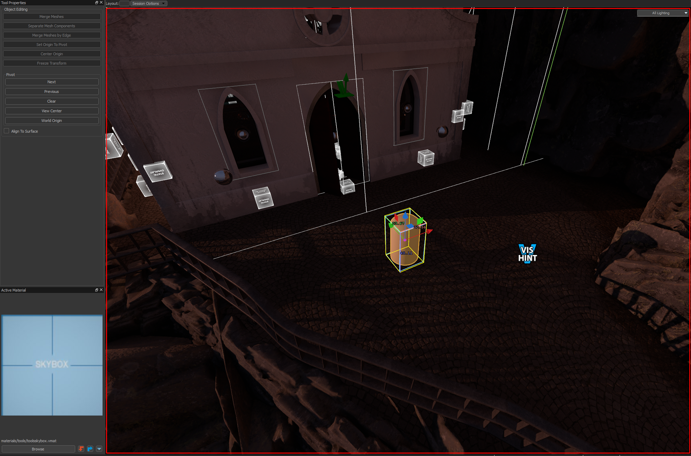
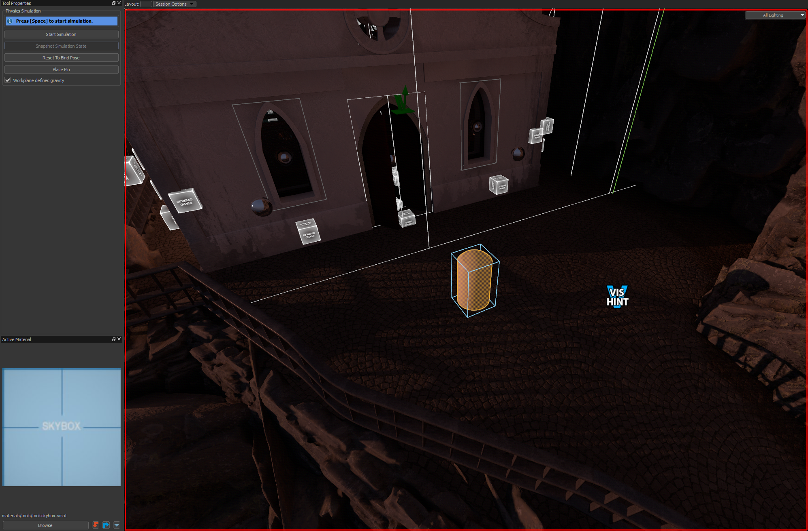
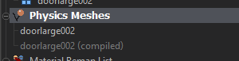
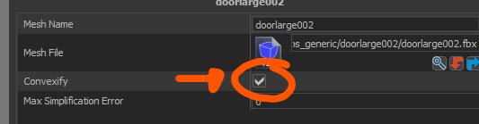
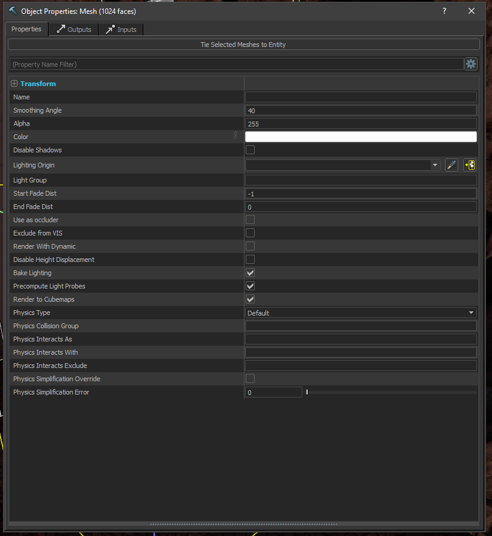
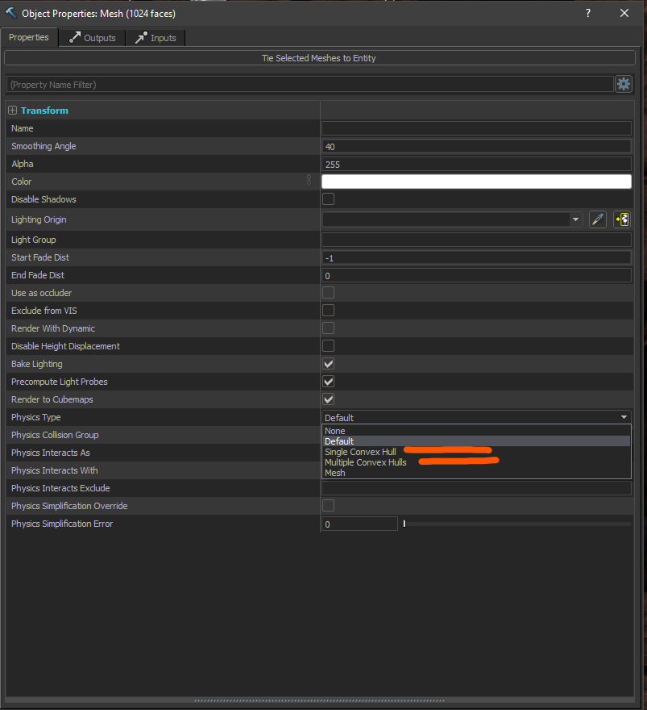

# Physics Simulation in Hammer
This guide will teach you how to simulate physics with your Hammer meshes/models.

:::info
For the physics engine inside Hammer to simulate, the object needs to have **convex collisions**. If not, the simulation will not run.
:::
--- 

## Physics Simulation with Models
1. Add a model to the world (can be any type of prop entity, e.g., **prop_static, prop_dynamic, prop_physics**).  

---  

2. Open the simulation tool or press **Shift + C** in case there is no Hammer icon (this happens in SteamVR).  

---  

3. Press **Space** to run the simulation.

<video width="100%" controls>
  <source src="/video/hammerphysmeshes_model.mp4" type="video/mp4" />
  Your browser does not support the video tag.
</video> 

---   

4.  Press **Space** to run stop the simulation.

---  
### Fix Some Props That Cannot Run in the Physics Simulation
Many times when running the physics simulation, a message appears saying:  

This can be fixed if the collision mesh is set to convex collision.  

**Games with ModelDoc Editor**

:::todo
:::

  

**Games with Model Editor (only <Game name="steamvr"/>)**

In the **Physic Meshes** node, enable the **convexify** option.  
  
  

  

---  
## Physics Simulation with Meshes
1. Create a new mesh in your world. 
:::warning
Mesh entities are not supported for physics simulation.
:::
  

---  
2. Open the property panel of the mesh (**Alt+Enter**) and set the collision to **single convex hull** or **multiple convex hulls**.  
  
  

--- 
3. Press **Space** to run the simulation.

<video width="100%" controls>
  <source src="/video/hammerphysmeshes_mesh.mp4" type="video/mp4" />
  Your browser does not support the video tag.
</video> 

--- 
4.  Press **Space** to run stop the simulation.