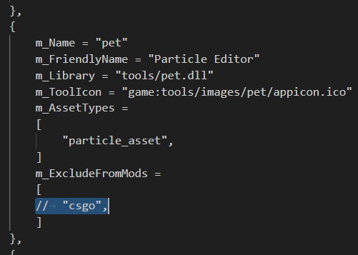

# Particle Editor

In Source2 particle effects are very powerful and can render almost anything in the engine such as sprites, lights, models, text, as well as run physical simulations.

The Particle Editor is a powerful tool that allows the creation of these particle effects, you can create effects from simple ambient particles such as leaves dropping in the wind or dust motes in the air to complex physical simulations involving thousands of particles. 

## Info

:::info
Parts of this section were taken from [Nibuja05's dota particle editor tutorial](https://github.com/Nibuja05/dota_particle_editor_tutorial) with the author's permission.
:::

:::warning
The particle editor is disabled in <Game name="cs2"/> by default, to enable it go to 
`steamapps/common/Counter-Strike Global Offensive/game/bin/sdkenginetools.txt`, in `m_EngineTools` find the `m_Name = "pet"` section 
and comment out `csgo` from `m_ExcludeFromMods`.

:::