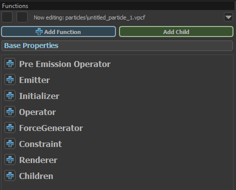

# Particle Editor Guide

This guide will go over the various functions and UI of the Particle Editor and explain how to create particle effects.

## Opening the Particle Editor

You can open the Particle Editor from the "Tools" dropdown, at the top right of the Asset Browser and from any Engine Tool.

## User Interface

Using the image above as a legend, the UI is comprised of the following:

### 1 - Top Tool Bar

Here you can find the standard menus and actions available in most tools.

- File 

    Allows you to load and save particle files, as well as open recently opened files.

- Edit 

    Allows you to cut, copy and paste as well as undo and redo.

- View

    Allows you to open any panels you might have closed or hidden, as well as some extra functionalities.

- Help

    Standard help menu from every tool, shows info about the current engine build and QT.

### 2 - Functions

This is the main stack of properties and functions that make up the particle effect.

### 3 - Properties

A properties panel for the currently selected property or function from the Functions panel. This is where you can alter properties.

### 4 - Viewport

The main panel of the Particle Editor. The Viewport allows you to preview your particle effect live in engine as you work on it.

You can move freely like in any 3D Scene preview in the editor.

The most useful button here is the "Visualise" button on the top tool bar of the Viewport, it allows you to visualise otherwise hidden or hard to
preview data like attributes (radius, alpha, creation time, etc.) and particle system data like control points.

The other buttons are self explanatory, you can hover over them in engine for a tooltip.

### 5 - Controls

This panel lets you set and control editor-only state of the particle effect, this will only affect the preview panel and will not reflect to ingame state or values.

The Controls panel is divided into two parts: Control Points and preview

- Control Points

    Control points started out as 3-dimensional vectors which could be set from game code.

    Nowadays theyre kinda just used as variables of various types, in this panel you can set and/or modify the values of Control Points.

    Clicking the little lock symbol next to the Control Point will make it so the value is saved for the next time you open this effect in the Particle Editor.

- Preview

    The preview part below is used for loading assets like models into the current effect. 
    This is only a test tool and has no influence on the final result displayed in the game. 
    It is essential for quick testing effects that might require other assets to be present.

### 6 - Current Assets

This panel is like a small Asset Browser and can be used to reopen (focus) currently opened particle effects without leaving the particle editor. Most of the time you can/should minimize this to have more space for your preview and other windows.

## Functions

All particle effects are made up of a collection of functions that make every effect work. Functions are divided into different groups.

You can find a complete list of all functions with their usage here: 

:::todo
:::

To add a function to one of these groups, just click the plus icon and choose an element from the list. 
You can also select multiple functions with ctrl or shift and copy, cut and paste. These actions work accross multiple particle effects.

:::info
Functions are priority-based. Sometimes two identical functions work together, sometimes only one of them can be active. 
When two Functions have a similiar or identical use case, only the last one in the list will be active, so functions at the bottom of a group have the highest priority.
:::

### Base Properties

These are the core properties of the effect. Most of these lie outside the scope of operators, and many define low-level engine settings that are generally left to their default values. 
The properties that will most commonly be modified are: 

- initial_particles 
- bounding_box_min and bounding_box_max 
- fallback replacement definition 
- view model effect 
- screen space effect 
- max_particles 

Additionally, some properties are here to provide a simple mechanism for defining effect defaults which can then be overridden by operators when necessary. These include: 

- color 
- radius 
- rotation 
- rotation_speed 
- lifetime 
- sequence_number 
- sequence_number 1

### Pre Emission Operator

These are functions which run before anything else, before any particles have been emitted.

They often manipulate Control Points, children, etc. You won’t need them for most particle effects, but some of the functions here are very interesting and can be useful for more complex particle effects.

Examples:

- Lightning Snapshot Generator 

    Generates a lighting shaped procedural snapshot.

- Drive CP from global sound float 

    Will drive a Control Point value from a sound.

- Set Simulation Timescale 

    Sets the timescale of the particle effect.

### Emitter

Emitters are functions which generate particles. 
Most particle effects will have at least one of these, The most commonly used emitters are:

- Emit continuously

    Emits particles in a set interval. emission rate is the count of particles emitted per second, emission duration is the duration in which particles are emitted and emission start time is a delay to the start of the emission in seconds.

- Emit instantaneously

    Emits particles directly at the start of the effect all at once. The emission can be delayed with emission start time.

### Initializer

Initializers run when particles are spawned and help setup the effect with initial values, most importantly the position of the particles.

Some of the most commonly used functions here are:

- Position within sphere random

    :::info
    Despite the name, this is the most commonly used initializer for making an effect spawn at the center of the particle entity by simply
    setting the random distance values to 0.
    :::

    Places new particles at a random position within a given radius around the center control point, which can be set with control point number
    
    The distance for each particle is chosen randomly between distance min and distance max. 
    This Initializer can also be used to place a particle at an exact position by leaving both distance values to 0. 

- Position along Ring
    
    The second most used positional initializer. Places new particles along a ring with a radius that can be set in initial radius. 
    With a thickness greater than 0, the particles are randomly placed in a distance < thickness around the “normal” ring position. 
    
    Particles are randomly distrubuted around the ring. If you want to change this, check even distribution. 
    This option forces all particles to spawn evenly spaced along the ring. With even distribution count you can control how many particles are needed to place a full ring, otherwise (-1) they are spread based on the total particle count.

    This Initializer is mostly used to create closed rings of particles, for example for a ring wave that travels outwards. It can be also very useful for spirals.

- Position on path sequential

    Places new particles along a path between two control points. this initializer is often used for ropes, chains, etc. start control point number and end control point number define where particles are placed. 
    
    Particles to map from start to end is the number of particles needed to fill the path, and maximum distance limits the length of the path, should the two Control Points be too far away from each other.     
    
    The "Use sequential CP pairs between start and end point" option uses all CP numbers between your start and end as well, so it can be used to draw shapes like a square (with start, end, and 2 in between). 

    Most used for beams (like a laser), lightnings or chains, but can be also used to position particles along shapes like triangles or rectangles.

- Lifetime random

    Sets the lifetime of the spawned particle to a random value between lifetime min and lifetime max.

- Radius random

    Sets the radius of the spawned particle to a random value between radius min and radius max.

- Rotation random
    
    Randomizes the initial rotation of the particle between yaw offset min and yaw offset max plus yaw initial on top of that. Mostly Roll is the important field important for basic sprites. 

- Color Random

    Sets the inital color to a random vector between color 1 and color 2. Ignore all other fields for now, they are rarely used.

- Alpha random

    Sets the alpha value randomly between alpha min and alpha max.