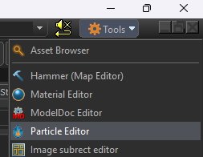
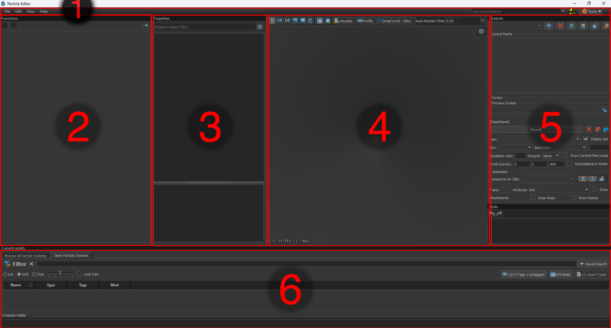

# Particle Editor Guide

This guide will go over the various functions and UI of the Particle Editor and explain how to create particle effects.

## Opening the Particle Editor

You can open the Particle Editor from the "Tools" dropdown, at the top right of the Asset Browser and from any Engine Tool.

## User Interface

Using the image above as a legend, the UI is comprised of the following:

### 1 - Top Tool Bar

Here you can find the standard menus and actions available in most tools.

- File 

    Allows you to load and save particle files, as well as open recently opened files.

- Edit 

    Allows you to cut, copy and paste as well as undo and redo.

- View

    Allows you to open any panels you might have closed or hidden, as well as some extra functionalities.

- Help

    Standard help menu from every tool, shows info about the current engine build and QT.

### 2 - Functions

This is the main stack of properties and functions that make up the particle effect.

### 3 - Properties

A properties panel for the currently selected property or function from the Functions panel. This is where you can alter properties.

### 4 - Viewport

The main panel of the Particle Editor. The Viewport allows you to preview your particle effect live in engine as you work on it.

You can move freely like in any 3D Scene preview in the editor.

The most useful button here is the "Visualise" button on the top tool bar of the Viewport, it allows you to visualise otherwise hidden or hard to
preview data like attributes (radius, alpha, creation time, etc.) and particle system data like control points.

The other buttons are self explanatory, you can hover over them in engine for a tooltip.

### 5 - Controls

This panel lets you set and control editor-only state of the particle effect, this will only affect the preview panel and will not reflect to ingame state or values.

The Controls panel is divided into two parts: Control Points and preview

- Control Points

    Control points started out as 3-dimensional vectors which could be set from game code.

    Nowadays theyre kinda just used as variables of various types, in this panel you can set and/or modify the values of Control Points.

    Clicking the little lock symbol next to the Control Point will make it so the value is saved for the next time you open this effect in the Particle Editor.

- Preview

    The preview part below is used for loading assets like models into the current effect. 
    This is only a test tool and has no influence on the final result displayed in the game. 
    It is essential for quick testing effects that might require other assets to be present.

### 6 - Current Assets

This panel is like a small Asset Browser and can be used to reopen (focus) currently opened particle effects without leaving the particle editor. Most of the time you can/should minimize this to have more space for your preview and other windows.