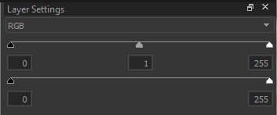
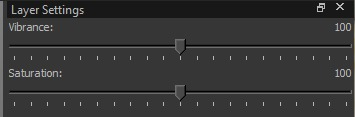
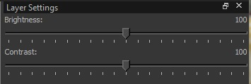
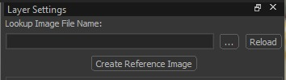
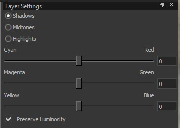
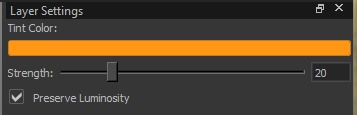
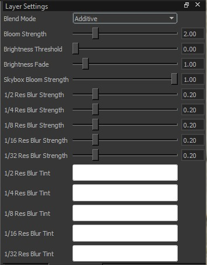
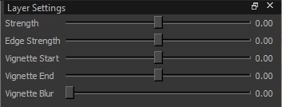

import { ReactCompareSlider, ReactCompareSliderImage } from "react-compare-slider";

{/* scale normal images and center them */}

{/* helpers to create slider grids */}
export const CompareSlider = ({
  title,
  before,
  after,
  altBefore = "Before",
  altAfter = "After",
  position = 50,
  sliderStyle = null,
  wrapStyle = null,
  maxWidth = 900,
  center = true,
}) => {
  const baseWrapStyle = {
    maxWidth,
    ...(center ? { margin: "0 auto" } : {}),
  };

  return (
    

      {title ? 
{title}
 : null}
      <ReactCompareSlider
        position={position}
        style={{
          width: "100%",
          borderRadius: 12,
          overflow: "hidden",
          ...(sliderStyle || {}),
        }}
        itemOne={<ReactCompareSliderImage src={before} alt={altBefore} />}
        itemTwo={<ReactCompareSliderImage src={after} alt={altAfter} />}
      />
    

  );
};

export const CompareGrid = ({
  columns = 2,
  gap = 16,
  maxWidth = 1200,
  margin = "0 auto",
  style = null,
  children,
}) => {
  return (
    

      {children}
    

  );
};

export const GridItem = ({ title, desc, imgSrc, imgAlt, imgStyle = null }) => {
  return (
    

      <b>{title}</b>
      {desc ? (
        <>
           
          {desc}
        </>
      ) : null}
      {imgSrc ? (
        
      ) : null}
    

  );
};

{/* end of helpers */}

# Post Processing Effects

## Masks

A mask controls where a post processing layer applies. In the Post Processing Editor, masks are tonal masks: they select pixels based on brightness (shadows, midtones, highlights), not based on world position or map geometry.

Think of it like: “apply this effect mostly to the dark parts of the image” or “only affect highlights”. Masks can be applied to any post processing effect.

If you want post processing to change based on map position (for example: indoor vs outdoor, tunnels vs open areas), you need to use different `post_processing_volume` entities and assign different `.vpost` presets to them.

### How the mask works

- White means the layer applies strongly.
- Black means the layer does not apply.
- Gray means the layer applies partially.

So if the mask targets highlights, only bright pixels will be strongly affected, while darker pixels are mostly untouched.

### Visual explanation

The editor visualizes masks as a curve.

- X-axis: pixel brightness (luminosity), from dark (left) to bright (right)
- Y-axis: mask strength, from 0 (no effect) to 1 (full effect)

Below are the three default mask types:

<CompareGrid columns={3} maxWidth={1200}>
  <GridItem
    title="Highlights mask"
    desc="Affects mostly bright pixels (right side of the curve)."
    imgSrc={require("./assets/img/masks/layer_mask_highlights.jpg").default}
    imgAlt="Highlights mask curve"
  />
  <GridItem
    title="Midtones mask"
    desc="Affects mostly medium brightness (center of the curve)."
    imgSrc={require("./assets/img/masks/layer_mask_midtones.jpg").default}
    imgAlt="Midtones mask curve"
  />
  <GridItem
    title="Shadows mask"
    desc="Affects mostly dark pixels (left side of the curve)."
    imgSrc={require("./assets/img/masks/layer_mask_shadows.jpg").default}
    imgAlt="Shadows mask curve"
  />
</CompareGrid>

### Mask controls

- Presets (Shadows / Midtones / Highlights)  
  Quick starting points for which brightness range you want to target.

- Luminosity
  Shifts the selection toward darker or brighter pixels. Ranges from 0 to 255.

- Width
  Controls how broad the selected brightness range is. Narrow width is more selective, wide width affects more of the image. Ranges from 0 to 100.

- Shape
  Controls how soft or harsh the transition is between affected and unaffected pixels.  Ranges from -100 to 100.

- Invert Mask  
  Flips the mask so it affects the opposite range (e.g. invert a highlights mask to affect everything except highlights).

You can only customize the tonal selection with Luminosity/Width/Shape, but you can’t paint or import a mask.

## Effects

### Levels

Adjusts the input/output tonal range of the image. Levels lets you define what should count as “black” and “white”, and how midtones are distributed in between. This is commonly used to fix washed-out images, increase contrast, or brighten shadows.

**Settings:**
- **Channel**: Selects which color data the adjustment affects:
  - **RGB**: Applies the adjustment uniformly to all channels (changes overall brightness/contrast without intentionally shifting the color balance).
  - **Red / Green / Blue**: Applies the adjustment to only that channel. This can change brightness *and* shift color balance (e.g., increasing the Red channel pushes colors toward red (cyan-ish tones lose their cyan tone); increasing Green pushes toward green (reducing a magenta tone); increasing Blue pushes toward blue (reducing a yellow tone).)

- **Settings per Channel**:
  - **Input levels** (remaps the incoming values of the input image):
    - **Black (0 to 255)**: Sets the input value that becomes pure black. Increasing it makes dark areas become black sooner (more shadow detail is lost). This darkens the image.
    - **Gamma**: Adjusts midtones. Lower gamma brightens midtones; higher gamma darkens midtones. This mainly affects midtones rather than the extremes.
    - **White (0 to 255)**: Sets the input value that becomes pure white. Decreasing it makes bright areas become white sooner (more highlight detail is lost). This brightens the image.

  - **Output levels** (limits the final values of the output image):
    - **Black (0 to 255)**: Raises the minimum output value (blacks become dark gray, producing a more “faded” look). This brightens the darkest parts of the image.
    - **White (0 to 255)**: Lowers the maximum output value (whites become slightly darker, reducing the peak brightness). This darkens the brightest parts of the image.

#### Examples (Levels)

<CompareGrid columns={3} maxWidth={1200}>
  <CompareSlider
    title="Input Black = 30"
    before={require("./assets/img/comparisons/base_before.jpg").default}
    after={require("./assets/img/comparisons/levels_input_black_30.jpg").default}
    altAfter="Levels Input Black 30"
  />
  <CompareSlider
    title="Input White = 220"
    before={require("./assets/img/comparisons/base_before.jpg").default}
    after={require("./assets/img/comparisons/levels_input_white_220.jpg").default}
    altAfter="Levels Input White 220"
  />
  <CompareSlider
    title="Gamma = 0.70"
    before={require("./assets/img/comparisons/base_before.jpg").default}
    after={require("./assets/img/comparisons/levels_gamma_070.jpg").default}
    altAfter="Levels Gamma 0.70"
  />
  <CompareSlider
    title="Output Black = 30"
    before={require("./assets/img/comparisons/base_before.jpg").default}
    after={require("./assets/img/comparisons/levels_output_black_30.jpg").default}
    altAfter="Levels Output Black 30"
  />
  <CompareSlider
    title="Output White = 220"
    before={require("./assets/img/comparisons/base_before.jpg").default}
    after={require("./assets/img/comparisons/levels_output_white_220.jpg").default}
    altAfter="Levels Output White 220"
  />
  <CompareSlider
    title="Gamma = 1.40"
    before={require("./assets/img/comparisons/base_before.jpg").default}
    after={require("./assets/img/comparisons/levels_gamma_140.jpg").default}
    altAfter="Levels Gamma 1.40"
  />
</CompareGrid>

---

### Saturation / Vibrance

Adjusts overall color intensity.

**Settings:**
- **Vibrance (-100 to 100)**: Increases or decreases color intensity in a more selective way. It affects weaker/less saturated colors more than already strong colors, so the result is more natural and less likely to oversaturate the image. At -100, the image becomes very washed out, but (depending on the input) still keeps a small amount of color.
- **Saturation (-100 to 100)**: Increases or decreases color intensity uniformly across the image. Higher values make all colors more intense; lower values move the image toward grayscale. At -100, the image becomes fully grayscale (black and white).

#### Examples (Saturation vs Vibrance)

<CompareGrid columns={2} maxWidth={900}>
  <CompareSlider
    title="Saturation +100"
    before={require("./assets/img/comparisons/base_before.jpg").default}
    after={require("./assets/img/comparisons/saturation_plus_100.jpg").default}
    altAfter="Saturation +100"
  />
  <CompareSlider
    title="Vibrance +100"
    before={require("./assets/img/comparisons/base_before.jpg").default}
    after={require("./assets/img/comparisons/vibrance_plus_100.jpg").default}
    altAfter="Vibrance +100"
  />
  <CompareSlider
    title="Saturation -100"
    before={require("./assets/img/comparisons/base_before.jpg").default}
    after={require("./assets/img/comparisons/saturation_minus_100.jpg").default}
    altAfter="Saturation -100"
  />
  <CompareSlider
    title="Vibrance -100"
    before={require("./assets/img/comparisons/base_before.jpg").default}
    after={require("./assets/img/comparisons/vibrance_minus_100.jpg").default}
    altAfter="Vibrance -100"
  />
</CompareGrid>

---

### Brightness / Contrast

Adjusts overall brightness and contrast.

**Settings:**
- **Brightness (-100 to 100)**: Uniformly shifts the overall image brightness up or down. Increasing it makes the whole image brighter. Decreasing it makes it darker.
- **Contrast (-100 to 100)**: Changes the difference between dark and bright areas. Increasing contrast makes shadows darker and highlights brighter. Decreasing contrast reduces the difference and makes the image look flatter / more washed out.

#### Examples (Brightness vs Contrast)

<CompareGrid columns={2} maxWidth={900}>
  <CompareSlider
    title="Brightness +50"
    before={require("./assets/img/comparisons/base_before.jpg").default}
    after={require("./assets/img/comparisons/brightness_plus_50.jpg").default}
    altAfter="Brightness +50"
  />
  <CompareSlider
    title="Contrast +50"
    before={require("./assets/img/comparisons/base_before.jpg").default}
    after={require("./assets/img/comparisons/contrast_plus_50.jpg").default}
    altAfter="Contrast +50"
  />
  <CompareSlider
    title="Brightness -50"
    before={require("./assets/img/comparisons/base_before.jpg").default}
    after={require("./assets/img/comparisons/brightness_minus_50.jpg").default}
    altAfter="Brightness -50"
  />
  <CompareSlider
    title="Contrast -50"
    before={require("./assets/img/comparisons/base_before.jpg").default}
    after={require("./assets/img/comparisons/contrast_minus_50.jpg").default}
    altAfter="Contrast -50"
  />
</CompareGrid>

---

### Color Lookup
Applies a lookup table (LUT) to remap the final image’s colors. Conceptually, a LUT is a big “input color --> output color” mapping: every pixel color is looked up in the table and replaced with the corresponding output color. In Source 2 this LUT is stored as a **lookup image texture** (e.g., `.tga`, `.jpg`), not a `.cube` file.

You normally don’t create LUTs by hand (painting/editing the lookup texture directly), because the image encodes a structured 3D color grid. Instead, the usual workflow is:
1) generate an **identity/reference LUT**,
2) apply your color grading adjustments (Curves / Color Balance / Levels / etc.) to that reference image in an editor,
3) save it and load it back as the lookup texture.

If you’re already achieving the look you want using other post-processing effects in the editor, you don’t need a LUT. Color Lookup is mainly useful as a **single, reusable “final grade”** you can swap, share, and iterate on quickly (edit externally --> hit **Reload**).

The default/reference lookup texture is a **32×32×32 LUT**. It can be exported using the Create Reference Image button.

**Settings:**
- **Lookup Image File Name**: Path to the LUT image used for color remapping.
- **Reload**: Re-imports the LUT after you edited/overwrote the file on disk.
- **Create Reference Image**: Generates an identity/reference LUT image (a tiled 2D grid) you can grade in an image editor and then load back in.

#### Example (Color Lookup)

This example uses the color lookup table of de_inferno. It was extracted using the Source2Viewer.

<CompareSlider
  before={require("./assets/img/comparisons/base_before.jpg").default}
  after={require("./assets/img/comparisons/color_lookup_after.jpg").default}
  altBefore="Before"
  altAfter="After"
  wrapStyle={{ maxWidth: 900, margin: "0 auto" }}
/>

---

### Color Balance

Shifts the image’s color tint by adding/removing complementary colors in a selected tonal range. Unlike **Levels** (which mainly remaps brightness/contrast per channel), **Color Balance** directly pushes colors toward Red/Cyan, Green/Magenta, and Blue/Yellow while trying to keep the overall tone structure intact. Naturally, it also works using complementary colors.

**Settings:**
- **Range**: Selects which tonal range is affected:
  - **Shadows**: mostly affects dark areas
  - **Midtones**: mostly affects mid-brightness areas
  - **Highlights**: mostly affects bright areas  
  Range uses three radio buttons (not a dropdown), but each range behaves like a separate channel.

- **Settings per Range**:
  - **Cyan ↔ Red (-100 to 100)**: shifts between cyan (less red) and red
  - **Magenta ↔ Green (-100 to 100)**: shifts between magenta (less green) and green
  - **Yellow ↔ Blue (-100 to 100)**: shifts between yellow (less blue) and blue

- **Preserve Luminosity**: Attempts to keep the perceived brightness similar while shifting color. This is a global toggle (not per range).

#### Examples (Color Balance)

<CompareGrid columns={3} maxWidth={1200}>
  <CompareSlider
    title="Shadows: Cyan (-80)"
    before={require("./assets/img/comparisons/base_before.jpg").default}
    after={require("./assets/img/comparisons/color_balance_shadows_red_-80.jpg").default}
    altAfter="Shadows Cyan (-80)"
  />

  <CompareSlider
    title="Shadows: Blue (+80)"
    before={require("./assets/img/comparisons/base_before.jpg").default}
    after={require("./assets/img/comparisons/color_balance_shadows_blue_+80.jpg").default}
    altAfter="Shadows Blue (+80)"
  />

  <CompareSlider
    title="Midtones: Red (+80)"
    before={require("./assets/img/comparisons/base_before.jpg").default}
    after={require("./assets/img/comparisons/color_balance_midtones_red_+80.jpg").default}
    altAfter="Midtones Red (+80)"
  />

  <CompareSlider
    title="Midtones: Green (+80)"
    before={require("./assets/img/comparisons/base_before.jpg").default}
    after={require("./assets/img/comparisons/color_balance_midtones_green_+80.jpg").default}
    altAfter="Midtones Green (+80)"
  />

  <CompareSlider
    title="Highlights: Yellow (-80)"
    before={require("./assets/img/comparisons/base_before.jpg").default}
    after={require("./assets/img/comparisons/color_balance_highlights_yellow_-80.jpg").default}
    altAfter="Highlights Yellow (-80)"
  />

  <CompareSlider
    title="Highlights: Magenta (-80)"
    before={require("./assets/img/comparisons/base_before.jpg").default}
    after={require("./assets/img/comparisons/color_balance_highlights_magenta_-80.jpg").default}
    altAfter="Highlights Magenta (-80)"
  />
</CompareGrid>

---

### Color Tint

Applies a tint color over the image. A warm yellow/orange tint here can quickly achieve the classic (if a bit ridiculous) “Mexico” movie look.

**Settings:**
- **Tint Color**: The color that is applied as an overlay/tint to the image. It uses the normal color selection tool. 
- **Strength (0 to 100)**: Controls how strongly the tint affects the image. Higher values make the tint more dominant; lower values make it more subtle.
- **Preserve Luminosity**: Keeps the image’s brightness more consistent while applying the tint, so the effect mainly shifts color rather than significantly brightening or darkening the image. Otherwise, darker colors tint the image less, but rather darken it uniformly.

#### Examples (Color Tint)

<CompareGrid columns={2} maxWidth={1200}>
  <CompareSlider
    title="Warm Tint - RGB 255 122 0 - Strength 60"
    before={require("./assets/img/comparisons/base_before.jpg").default}
    after={require("./assets/img/comparisons/color_tint_warm_60.jpg").default}
    altAfter="Warm tint (RGB 255 122 0, Strength 60)"
  />

  <CompareSlider
    title="Cool Tint - RGB 0 167 255 - Strength 60"
    before={require("./assets/img/comparisons/base_before.jpg").default}
    after={require("./assets/img/comparisons/color_tint_cold_60.jpg").default}
    altAfter="Cool tint (RGB 0 167 255, Strength 60)"
  />
</CompareGrid>

---

### Hue / Saturation

Shifts hue and adjusts saturation/lightness for a selected channel. This is useful for targeted color tweaks (e.g. reducing overly saturated reds) without changing the entire image equally.

It’s similar to **Saturation / Vibrance**, but more selective. Saturation / Vibrance affects the whole image, while Hue / Saturation can target specific color ranges (Reds, Yellows, Greens, etc.) and also allows shifting hue and adjusting lightness for just that range.

The selected **Channel** (e.g., Magentas) is treated as the original target range. The tool first finds pixels that are magenta-ish in the original image (with smooth blending into neighboring hues), and then applies the Hue/Saturation/Lightness changes to *those pixels*. When selecting a big Hue shift, those pixels may no longer *look* magenta - but they are still affected because they matched the original Magentas range. Hue wraps around the circle, so +180° and −180° are equivalent.

The behavior of the **Lightness** slider *seems* closer to an HSL-style model (Hue/Saturation/Lightness) than HSV, but the exact internal math may differ (I’m not 100% sure).

**Example:**  
If you select Magentas and set Hue = +90, a magenta pixel (roughly #FF00FF) rotates 90° forward on the hue wheel - from 300° --> 30° - becoming an orange-ish color (around #FF8000).  
If you set Hue = -90, the same pixel rotates backward - from 300° --> 210° - becoming a bluish-cyan color (around #007FFF).

This can be simulated well here (to visualize Hue rotations):
- https://colorizer.org/
- https://bottosson.github.io/misc/colorpicker/

**Settings:**
- **Channel**: Selects which color range is affected:
  - **Master**: Applies to all colors.
  - **Reds, Yellows, Greens, Cyans, Blues, Magentas**: Applies mainly to that color range (with smooth blending into neighboring colors).

- **Settings per Channel**:
  - **Hue (-180 to 180)**: Rotates the selected colors along the color wheel (changes “what color” they are).
  - **Saturation (-100 to 100)**: Increases or decreases color intensity for the selected colors.
  - **Lightness (-100 to 100)**: Increases or decreases brightness for the selected colors (can make a color range appear lighter or darker without affecting other ranges as much).

#### Examples (Hue / Saturation)

<CompareGrid columns={3} maxWidth={1200}>
  <CompareSlider
    title="Magentas: Hue +90"
    before={require("./assets/img/comparisons/base_before.jpg").default}
    after={require("./assets/img/comparisons/hsl_magentas_hue_+90.jpg").default}
    altAfter="Magentas Hue +90"
  />

  <CompareSlider
    title="Master: Hue +90"
    before={require("./assets/img/comparisons/base_before.jpg").default}
    after={require("./assets/img/comparisons/hsl_master_hue_+90.jpg").default}
    altAfter="Master Hue +90"
  />

  <CompareSlider
    title="Reds: Saturation -80"
    before={require("./assets/img/comparisons/base_before.jpg").default}
    after={require("./assets/img/comparisons/hsl_reds_sat_-80.jpg").default}
    altAfter="Reds Saturation -80"
  />

  <CompareSlider
    title="Yellows: Saturation +80"
    before={require("./assets/img/comparisons/base_before.jpg").default}
    after={require("./assets/img/comparisons/hsl_yellows_sat_+80.jpg").default}
    altAfter="Yellows Saturation +80"
  />

  <CompareSlider
    title="Greens: Lightness +40"
    before={require("./assets/img/comparisons/base_before.jpg").default}
    after={require("./assets/img/comparisons/hsl_greens_lightness_+40.jpg").default}
    altAfter="Greens Lightness +40"
  />

  <CompareSlider
    title="Yellows: Lightness -40"
    before={require("./assets/img/comparisons/base_before.jpg").default}
    after={require("./assets/img/comparisons/hsl_yellows_lightness_-40.jpg").default}
    altAfter="Yellows Lightness -40"
  />
</CompareGrid>

---

### Curves

Adjusts tonal response using editable curves. Curves let you remap how dark, mid, and bright values are distributed by changing the response curve of a channel. This is commonly used for fine-grained contrast control (e.g., an “S-curve” for more contrast) or for color shifts when editing individual channels.

<CompareGrid columns={2} maxWidth={1200}>
  <GridItem
    title="RGB overview (read-only)"
    desc="Shows all three curves at once for reference, but cannot be edited."
    imgSrc={require("./assets/img/settings/layer_settings_curves.jpg").default}
    imgAlt="Curves settings (RGB overview)"
  />
  <GridItem
    title="Single channel editor"
    desc="Shows one curve (Red/Green/Blue) and allows editing by adding and dragging points."
    imgSrc={require("./assets/img/settings/layer_settings_curves_1.jpg").default}
    imgAlt="Curves settings (single channel editor)"
  />
</CompareGrid>

**Settings:**
- **Channel**: Selects which curve(s) are shown:
  - **RGB**: Displays all three color curves together for reference. The black curve (applied to all channels) can be edited here.
  - **Red / Green / Blue**: Displays the selected channel’s curve only. You can edit it by clicking/dragging to bend the curve.

**How to edit:**
- Clicking on the curve adds a **control point**. The curve is defined by points: the fixed endpoints (bottom-left = pure black, top-right = pure white) and any points you add.
- When you drag a point, the curve changes between that point and its neighboring points (or, if there are no neighbors on one side, between the point and the nearest endpoint). This lets you adjust a specific tonal region without reshaping the entire curve.
- Adding more points gives more fine control, because you can “lock” parts of the curve in place while changing others (e.g., keep shadows close to the original line while adjusting only midtones).

**How to read the curve:**
- The horizontal axis represents the input value (dark --> bright).
- The vertical axis represents the output value after the curve is applied.
- Raising part of a curve makes that tonal range brighter for that channel; lowering it makes it darker. Editing individual channels can also shift colors (e.g., raising Red can reduce a cyan cast in the affected tonal range).

#### Example (Curves)

The curves shown here are doing a color grade, not just “more contrast”.

- **Red curve:** fully above the diagonal --> adds red (warmer look).
- **Green curve:** fully below the diagonal --> removes green (adds magenta).
- **Blue curve:** above the diagonal around the middle only, otherwise below --> adds a bit of blue mainly in midtones.

This results in a generally warmer / more orange-magenta tint, with more blue in the midtones (barely visible).  
This example is exaggerated for clarity. In actual grading you want curves that only slightly deviate from the diagonal.

{/* Can't use normal CompareGrid since we have the flexbox here... */}

  

    
Before / After

    <ReactCompareSlider
      position={50}
      style={{ width: "100%", borderRadius: 12, overflow: "hidden" }}
      itemOne={
        <ReactCompareSliderImage
          src={require("./assets/img/comparisons/base_before.jpg").default}
          alt="Before"
        />
      }
      itemTwo={
        <ReactCompareSliderImage
          src={require("./assets/img/comparisons/curves_after.jpg").default}
          alt="After"
        />
      }
    />
  

  

    
Curve used

    
  

---

### Tone Mapping

Controls the overall tone mapping curve (how brightness rolls off from shadows to highlights).

<CompareGrid columns={4} maxWidth={1200}>
  <GridItem
    title="Linear (S1)"
    desc="Straight/neutral response"
    imgSrc={require("./assets/img/presets/tone_mapping_linear.jpg").default}
    imgAlt="Tone Mapping preset: Linear (S1)"
  />
  <GridItem
    title="Low Contrast"
    desc="Flatter tonal separation"
    imgSrc={require("./assets/img/presets/tone_mapping_low_contrast.jpg").default}
    imgAlt="Tone Mapping preset: Low Contrast"
  />
  <GridItem
    title="High Contrast"
    desc="Stronger tonal separation"
    imgSrc={require("./assets/img/presets/tone_mapping_high_contrast.jpg").default}
    imgAlt="Tone Mapping preset: High Contrast"
  />
  <GridItem
    title="Hable (U2/HLVR)"
    desc="Filmic highlight roll-off"
    imgSrc={require("./assets/img/presets/tone_mapping_hable.jpg").default}
    imgAlt="Tone Mapping preset: Hable (U2/HLVR)"
  />
</CompareGrid>

Settings:
- **Presets**: Already defined curves.
  - **Linear (S1)**: Very direct response. Bright areas clip sooner and more harshly.
  - **Low Contrast**: More compressed/flat look. Less difference between dark and bright areas.
  - **High Contrast**: More separation. Darker shadows and brighter highlights (more “punch”).
  - **Hable (U2/HLVR)**: Film-like curve. Smoother highlight roll-off (less harsh clipping).

- **Exposure Bias (stops) (-4 to 4)**: Overall brightness before tone mapping.  
  Positive = brighter, negative = darker. 1 stop = twice as bright (or half as bright in the other direction).

- **Shoulder Strength (0 to 1)**: Controls what happens in the highlights.  
  Higher = highlights are compressed more (bright spots get toned down and roll off smoothly).

- **Linear Strength (0 to 1)**: Controls how “straight” the midtones behave.  
  Higher = midtones respond more directly (less compression).

- **Linear Angle (0 to 1)**: Midtone slope.  
  Higher = stronger midtone contrast; lower = softer midtone contrast.

- **Toe Strength (0 to 1)**: Controls what happens in the shadows.  
  Higher = shadows are compressed more (darker areas change more gently near black).

- **Toe Numerator (0 to 1)**: Fine control of the shadow “toe” shape.  
  Tweaks how quickly shadows lift out of black (steeper vs softer transition).

- **Toe Denominator (0 to 1)**: Fine control of the shadow “toe” shape.  
  Works with Toe Numerator to shape the shadow transition (steeper vs softer).

- **White Point (linear scale) (0 to 32)**: Controls where the highlight roll-off starts.  
  Lower = highlights start compressing earlier (bright areas are reduced sooner).  
  Higher = allows brighter highlights before compression kicks in.

#### Examples (Tone Mapping Presets)

<CompareGrid columns={2} maxWidth={1200}>
  <CompareSlider
    title="Linear (S1)"
    before={require("./assets/img/comparisons/base_before.jpg").default}
    after={require("./assets/img/comparisons/tone_mapping_linear.jpg").default}
    altAfter="Linear (S1)"
  />

  <CompareSlider
    title="Low Contrast"
    before={require("./assets/img/comparisons/base_before.jpg").default}
    after={require("./assets/img/comparisons/tone_mapping_low_contrast.jpg").default}
    altAfter="Low Contrast"
  />

  <CompareSlider
    title="High Contrast"
    before={require("./assets/img/comparisons/base_before.jpg").default}
    after={require("./assets/img/comparisons/tone_mapping_high_contrast.jpg").default}
    altAfter="High Contrast"
  />

  <CompareSlider
    title="Hable (U2/HLVR)"
    before={require("./assets/img/comparisons/base_before.jpg").default}
    after={require("./assets/img/comparisons/tone_mapping_hable.jpg").default}
    altAfter="Hable (U2/HLVR)"
  />
</CompareGrid>

---

### Bloom

Adds bloom/glow around bright areas. Bloom works by extracting pixels above a brightness threshold, blurring them, and blending the result back onto the image to create a soft glow. It is an effect used in many AAA games.

**Settings:**
- **Blend Mode**: Controls how the bloom is combined with the original image:
  - **Additive**: Adds light on top of the image (strongest/most “glowy”).
  - **Screen**: Brightens in a softer way than additive (less likely to blow out).
  - **Blur**: More of a hazy/softened effect; can look like general glare.

- **Bloom Strength (0 to 1 for Screen, 0 to 10 for Additive & Blur)**: Overall intensity of the bloom effect.
- **Brightness Threshold (0 to 10)**: Minimum brightness required for a pixel to contribute to bloom. Higher values restrict bloom to only the brightest highlights.
- **Brightness Fade (0 to 10)**: Smooths the threshold edge. Higher values make the transition into bloom softer; lower values make it more sudden.
- **Skybox Bloom Strength (0 to 1)**: Separate bloom intensity applied to the skybox (since the sky is usually bright, normal bloom settings shouldn’t be applied to it blindly).

**Multi-resolution blur controls:**  
Bloom is composed from several blurred highlight layers at different downsampled resolutions (1/2 --> 1/32). Higher-res layers create tight, edgey glow; lower-res layers create wide, soft haze when upscaled.

- **Blur Strength (per resolution, 0 to 1):**  
  Sets how much each layer contributes. Increase **1/2–1/4** for tighter halos; increase **1/16–1/32** for big, dreamy glow. If the image looks washed out, lower the **1/16–1/32** strengths first.

- **Blur Tint (per resolution):**  
  Color-multiplies each layer. Use neutral/white for natural bloom, or tint selectively (often a subtle tint on a lower-res layer) for stylized warm/cool/neon glow.

#### Examples (Bloom)

<CompareGrid columns={2} maxWidth={1200}>
  <CompareSlider
    title="Bloom - Weaker (Screen, Strength 0.25, Threshold 1.4, Fade 1.0)"
    before={require("./assets/img/comparisons/bloom_before.jpg").default}
    after={require("./assets/img/comparisons/bloom_weak.jpg").default}
    altAfter="Bloom - Weaker (Screen, Strength 0.25, Threshold 1.4, Fade 1.0)"
  />

  <CompareSlider
    title="Bloom - Stronger (Additive, Strength 2.0, Threshold 0.8, Fade 2.2)"
    before={require("./assets/img/comparisons/bloom_before.jpg").default}
    after={require("./assets/img/comparisons/bloom_strong.jpg").default}
    altAfter="Bloom - Stronger (Additive, Strength 2.0, Threshold 0.8, Fade 2.2)"
  />
</CompareGrid>

---

### Vignette

Darkens (or tints) the image toward the edges, drawing focus toward the center.

Settings:
- **Strength (-1 to 1)**: Overall vignette intensity (negative = darker edges, positive = brighter edges).
- **Radius (0 to 3)**: Size of the unaffected center area before the falloff starts.
- **Feather (0 to 1)**: Softness of the transition from center to edges (higher = smoother).
- **Roundness (0 to 1)**: Shape of the vignette (lower = more oval/square, higher = more circular).
- **Tint**: Color applied to the vignette. **Note:** In practice this appears to only have an effect when Strength is negative (darkening vignette).
- **Center X / Center Y (-1 to 1)**: Moves the vignette center point.
- **Recenter**: Resets the center back to the image center.

#### Examples (Vignette)

<CompareGrid columns={2} maxWidth={1200}>
  <CompareSlider
    title="Vignette - Subtle (Strength -0.25, Radius 1.8, Feather 0.70, Roundness 0.90)"
    before={require("./assets/img/comparisons/base_before.jpg").default}
    after={require("./assets/img/comparisons/vignette_subtle.jpg").default}
    altAfter="Vignette - Subtle"
  />

  <CompareSlider
    title="Vignette - Strong (Strength -0.65, Radius 1.3, Feather 0.55, Roundness 0.95)"
    before={require("./assets/img/comparisons/base_before.jpg").default}
    after={require("./assets/img/comparisons/vignette_strong.jpg").default}
    altAfter="Vignette - Strong"
  />

  <CompareSlider
    title="Vignette - Bright Edges (Strength +0.35, Radius 1.6, Feather 0.65, Roundness 0.90)"
    before={require("./assets/img/comparisons/base_before.jpg").default}
    after={require("./assets/img/comparisons/vignette_bright_edges.jpg").default}
    altAfter="Vignette - Bright Edges"
  />

  <CompareSlider
    title="Vignette - Tinted (Strength -0.55, Radius 1.5, Feather 0.65, Roundness 0.90, Tint #00A7FF (Azure / Blue))"
    before={require("./assets/img/comparisons/base_before.jpg").default}
    after={require("./assets/img/comparisons/vignette_tinted.jpg").default}
    altAfter="Vignette - Tinted"
  />
</CompareGrid>

---

### Local Contrast

Boosts micro-contrast (contrast at small detail scales) to make textures and edges look clearer. It increases contrast around existing detail, which can look like sharpness.

Settings:
- **Strength (-2 to 2)**: Main intensity of the effect.  
  Higher = more “crisp/clear”. Lower = less contrast on small details (can look softer/less sharp).

- **Edge Strength (-2 to 2)**: How much the effect targets edges specifically.  
  Higher = stronger edge pop / more punch. Lower = less visible edges.

- **Vignette Start (-2 to 2)** / **Vignette End (-2 to 2)**: These define a mask for the effect.

- **Vignette Blur (0 to 1)**: Softness of that mask transition.  
  Higher = smoother blend / stronger Vignette. Lower = less Vignette.

#### Example (Local Contrast)

<CompareSlider
  title="Local Contrast - After (Strength 1.20, Edge Strength 1.40)"
  before={require("./assets/img/comparisons/local_contrast_before.jpg").default}
  after={require("./assets/img/comparisons/local_contrast_after.jpg").default}
  altAfter="Local Contrast - After (Strength 1.20, Edge Strength 1.40)"
  wrapStyle={{ maxWidth: 900, margin: "0 auto" }}
/>
