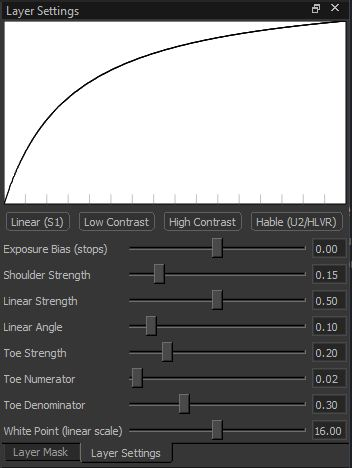
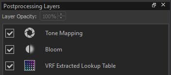

# Post Processing Exaples from official maps

## Introduction

:::info Disclaimer
When inspecting Valve’s `.vpost` files, keep in mind that only Bloom and Tone Mapping settings are directly recoverable!  
All other effects (Levels / Curves / Color Balance / etc.) are baked into a Color Lookup Table (LUT) for efficiency, so you’ll only see the final LUT result rather than the original per-layer settings.  
(Explained in the Post Processing Editor Guide.)
:::

### How to inspect existing `.vpost` files

Use the <Tool name="s2v" link="https://valveresourceformat.github.io/" /> to decompile Valve’s shipped `.vpost` files so you can inspect them (and optionally save them into your addon for editing).

Official post processing presets are stored in:

`game/csgo/pak01_dir.vpk/lighting/postprocessing/`

Remember - the `.vpost` file is only part of the final result! The `post_processing_volume` entity settings (especially exposure controls / transitions) also matter. Furthermore, entities like `light_environment`, `env_sky`, and `env_combined_light_probe_volume` also heavily influence the final look by defining the scene’s lighting, sky/atmosphere, and ambient/reflection contribution that the post processing is applied on top of.

### Other post processing effects

CS2 also uses post processing for various screen-space gameplay effects. These are stored in: `lighting/postprocessing/effects/`

Examples include effects used for:
- spectating a player / observer view
- death cam / death-related effects

## Official Map Examples

All of these maps use **exactly one Master** `post_processing_volume` for their baseline look.

All of these settings were decompiled by the <Tool name="s2v" link="https://valveresourceformat.github.io/" />.

### Train

**`.vpost` file:** `lighting/postprocessing/de_train_prefab/de_train_postprocess.vpost`

**`post_processing_volume` settings:**
- **Use Exposure Settings**: `True`
- **Min Exposure Brightness**: `0.8`
- **Max Exposure Brightness**: `1.2`
- **Exposure Adjustment Speed Up**: `0.75`
- **Exposure Adjustment Speed Down**: `0.75`
- **Transition Time**: `1`

#### Example Layer Stack

#### Layer 1 (Top): Tone Mapping

Uses the **Hable** preset curve.

#### Layer 2: Bloom

- **Blend Mode:** `Screen`
- **Bloom Strength:** `0.30`
- **Brightness Threshold:** `1.03`
- **Brightness Fade:** `1.03`
- **Skybox Bloom Strength:** `0.75`
- **Res Blur Strengths (1/2 --> 1/32):** `0.20`
- **Res Blur Tints (1/2 --> 1/32):** `255 255 255` (white)

#### Layer 3: Lookup Table

Baked LUT resulting from all other effects.

---

### Inferno

**`.vpost` file:** `lighting/postprocessing/de_inferno_prefab/de_inferno_prefab.vpost`

**`post_processing_volume` settings:**
- **Use Exposure Settings**: `True`
- **Min Exposure Brightness**: `0.8`
- **Max Exposure Brightness**: `1.1`
- **Exposure Adjustment Speed Up**: `1`
- **Exposure Adjustment Speed Down**: `1`
- **Transition Time**: `1.5`

#### Layer Stack

#### Layer 1 (Top): Tone Mapping

Uses the **Hable** preset curve.

#### Layer 2: Bloom

- **Blend Mode:** `Additive`
- **Bloom Strength:** `0.23`
- **Brightness Threshold:** `0.55`
- **Brightness Fade:** `0.91`
- **Skybox Bloom Strength:** `0.18`
- **Res Blur Strengths (1/2 --> 1/32):** `0.20`
- **Res Blur Tints (1/2 --> 1/32):** `255 255 255` (white)

#### Layer 3: Lookup Table

Baked LUT resulting from all other effects.

---

### Ancient

**`.vpost` file:** `lighting/postprocessing/de_ancient_prefab/de_ancient_postprocess_v1.vpost`

**`post_processing_volume` settings:**
- **Use Exposure Settings**: `True`
- **Min Exposure Brightness**: `1.0`
- **Max Exposure Brightness**: `1.7`
- **Exposure Adjustment Speed Up**: `1`
- **Exposure Adjustment Speed Down**: `1`
- **Transition Time**: `1`

#### Layer Stack

#### Layer 1 (Top): Tone Mapping

Uses the **Hable** preset curve.

#### Layer 2: Bloom

- **Blend Mode:** `Additive`
- **Bloom Strength:** `0.16`
- **Brightness Threshold:** `1.14`
- **Brightness Fade:** `1.02`
- **Skybox Bloom Strength:** `1.00`
- **Res Blur Strengths (1/2 --> 1/32):** `0.20`
- **Res Blur Tints (1/2 --> 1/32):** `255 255 255` (white)

#### Layer 3: Lookup Table

Baked LUT resulting from all other effects.

