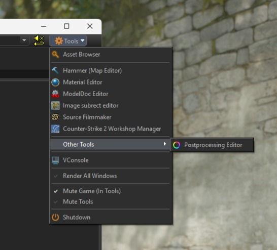
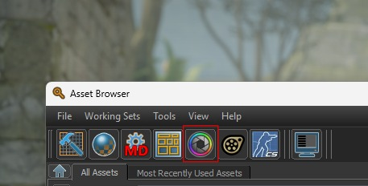
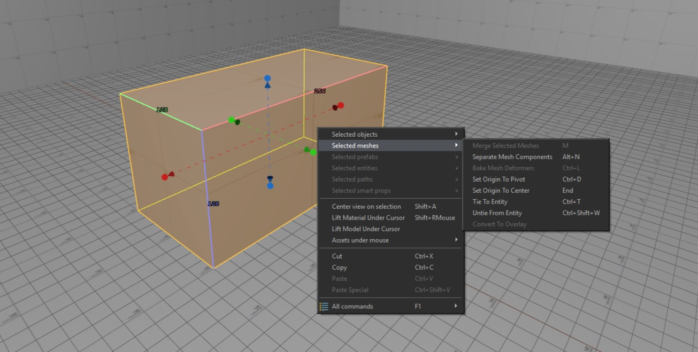
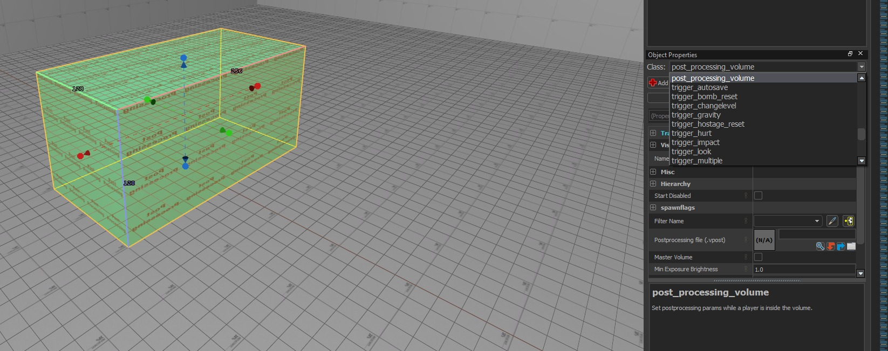
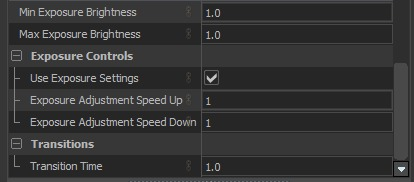

# Post Processing Editor Guide

This guide will go over the various functions and UI of the Post Processing Editor and explain how to create post processing effects.

## Opening the Post Processing Editor

You can open the Post Processing Editor from the **Tools** dropdown at the top right of the Asset Browser (and from any Engine Tool). It is the only entry under **Other Tools**.

You can also open the Post Processing Editor from the Asset Browser top row.

## User Interface

Using the image above as a legend, the UI is composed of the following:

### 1 - Top Tool Bar

Here you can find the standard menus and actions available in most tools.

- File  
  Open/save `.vpost` files, and access recently opened files.

- Edit  
  Standard actions like undo/redo.

- View / Window  
  Show/hide panels and reset layouts.

- Help  
  Tool/build info and general help.

### 2 - Preview Setup + Global Preview

This row controls how the effect is previewed. Global Preview is the important setting. If it’s off, the post processing is only shown inside the Post Processing Editor (in the Viewport). If it’s on, the post processing is shown in all the other windows as well — including inside CS2 and the GPU Path Tracing Preview in Hammer. This lets you live-edit and see changes immediately while running your map. You do not have to compile it every time to edit the post processing! The scene/model fields are used for the display in the viewport.

### 3 - Viewport

This is the live preview. It has its own viewport controls in the top right, including a maximize/fullscreen option. You’ll also find render options there (for example toggling skybox, grid, shadows) and ToolsVis modes for inspecting different buffers like Albedo, Roughness, Normal, Ambient Occlusion, etc.

You can use the viewport to get started, but doing the actual tuning in-game with Global Preview enabled generally makes more sense, since post processing depends heavily on the real map lighting, materials, skybox, etc.

You can have multiple viewports inside the post processing editor at the same time, by opening multiple post processing files at the same time. Global Preview follows the viewport currently in focus.

### 4 - Layer Settings

Settings for the currently selected layer. This is where you actually tweak curves/sliders/values for whatever layer you clicked. The settings for each effect are explained in the effects page.

### 5 - Postprocessing Layers

This is the layer stack for your `.vpost`.

In general, layer order matters because layers are applied in stack order (bottom --> top). Bottom layers are applied first, so swapping layers can change the final look.

Each layer can also have a mask; masked layers are marked with a small M in the list. Masks are explained in the effects page. Furthermore, each layer has a Layer Opacity, which decides how strongly the layer is applied. If the Opacity is `100%`, the layer is applied at full strength.

:::warning Runtime order + baking of effects
Not all layers behave like “normal” stack effects.

**At runtime, Source 2 post processing runs in two phases:**
1) **Tone Mapping + Bloom**
2) **All other Effects**

### What this means
- Tone Mapping and Bloom layer order doesn’t matter. They are applied in the dedicated first phase.
- Only one Tone Mapping layer and one Bloom layer can have an effect.  
- If you place multiple of either type, the lowest (bottom-most) one wins, and the others are ignored.
- The order for all other effects does matter and is applied after Tone Mapping + Bloom.

### Why Tone Mapping + Bloom aren’t baked
Tone Mapping and Bloom depend on the current frame’s brightness (highlights, exposure changes, sky brightness, etc.), so they can't be baked into a static LUT.

### Why you can't recover all settings after compile
All other layers (Levels / Curves / Color Balance / Hue-Sat / etc.) are effectively baked into a single Color Lookup Table (explained in the Effects section) during build/compile.  
So after compilation you can only extract the resulting LUT, but you generally cannot reconstruct the original per-layer settings that produced it.
:::

## Post Processing Volumes

Post-processing settings are applied in-map using **volumes**. To create one, draw a mesh with the **Block Tool** and tie it to a `post_processing_volume` entity. The post-processing settings are only applied **inside** the volume. This automatically assigns the `tools_post_processing` material.

In the dropdown select "post_processing_volume".

When volumes overlap, the most specific/inner volume takes priority. This allows for fine control for e.g outdoor vs indoor spaces.

### Master Volume

To apply post-processing to the entire level, create a post-processing volume and enable **Master**:

A master volume can be any shape or size, so many maps place a small cube and use it as a master volume. That way it works similarly to a "global"-affecting entity like the `light_environment`.

The master volume is active by default and remains in effect until the player enters another post-processing volume. When the player leaves that volume, the settings revert back to the master volume.

If you don’t set up a master volume, you can end up with inconsistent visuals (different areas looking unintentionally different).

### Other Settings

#### Exposure Control

Controls **auto-exposure** (eye adaptation): the game automatically brightens or darkens the final image as you move between dark and bright areas.

**Settings:**
- **Min Exposure Brightness**: Lower clamp for auto-exposure. Prevents the image from getting darker than this value.
- **Max Exposure Brightness**: Upper clamp for auto-exposure. Prevents the image from getting brighter than this value.  
  If **Min = Max** (e.g., both `1.0`), auto-exposure is effectively locked to a fixed exposure.
- **Use Exposure Settings**: Enables these exposure settings for the current post-processing volume.
- **Exposure Adjustment Speed Up**: How quickly exposure adapts when the scene gets brighter (camera “darkens” to compensate). Higher values = faster adaptation.
- **Exposure Adjustment Speed Down**: How quickly exposure adapts when the scene gets darker (camera “brightens” to compensate). Higher values = faster adaptation.
- **Transition Time**: Time (in seconds) used to blend from the previous volume’s exposure settings to the new volume’s settings. Lower values switch faster - higher values feel smoother.
