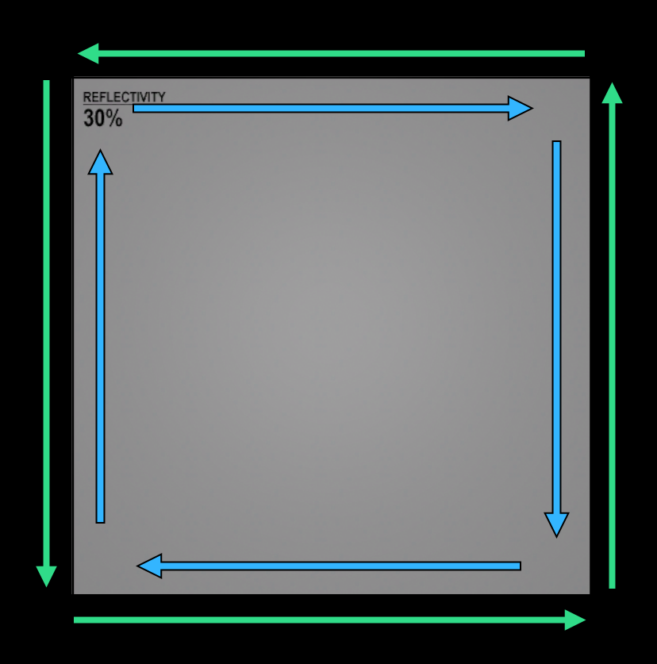

.vmap is the file format for uncompiled Source2 maps when they are being edited in [Hammer](../../EngineTools/HammerEditor/index.mdx).

It is a [DMX](../dmx.md) file under binary encoding version 4, [Hammer](../../EngineTools/HammerEditor/index.mdx) can export a plain text version if you go to `File -> Save Copy As Text`

:::info
<Tool name="s2v"/> can decompile compiled maps (.vmap_c usually contained within a VPK) into a .vmap\
<Tool name="github" suffix="Datamodel.NET" link="https://github.com/kristiker/Datamodel.NET"/> can be used to read and write kv2 files including vmaps, using C#.

An implemented version of the vmap format as described here can be found in the source code of <Tool name="github" suffix="VRF (s2v)" link="https://github.com/ValveResourceFormat/ValveResourceFormat/blob/master/ValveResourceFormat/IO/ContentFormats/ValveMap.cs"/>, used for vmap_c decompilation.
:::

## Vmap example

The following is a simple vmap in plain text format from <Game name="cs2" /> consisting of a hammer mesh and an entity.

:::info
The Root of a vmap DMX file is `CMapRootElement`\
In the text encoding of DMX, when an Element is only referenced once, it will be directly inserted as a value of the property that references it, when it's referenced multiple times, it will be extracted and put into the Root element, and everything referencing it will reference its UUID.
:::

[Vmap example](./example.vmap.mdx) (external page due to the large size)

## Vmap file structure

A list of vmap DMX nodes can be found below, this list is based on a <Game name="cs2" /> version 40 vmap.

Annoyingly the [naming convention](https://en.wikipedia.org/wiki/Naming_convention_(programming)) of attributes in vmaps is all over the place, some of the cases used include:
- flatcase
- camelCase
- PascalCase
- snake_case
- `m_` member variable notation

:::todo
Would be nice to have info on which nodes exists in what vmap version, and possibly even game specific vmap nodes.
:::

### "$prefix_element$"

The prefix element section is a DataModel feature allowing formats to store metadata, in vmaps it is used to store the map thumbnail and asset references.

```json
"$prefix_element$"
{
	"id" "elementid" "836b03ef-c2a5-41a2-a13e-308a114a46b7"
	"asset_preview_thumbnail" "binary" 
	"
		FFD8FFE000104A46494600010101006000600000FFDB004300030202030202030303030403030405
		0805050404050A070706080C0A0C0C0B0A0B0B0D...(shortened for example)
	"
	"asset_preview_thumbnail_format" "string" "jpg"
	"map_asset_references" "string_array" 
	[
		"materials/dev/reflectivity_30.vmat"
	]
}

- asset_preview_thumbnail \<`binary`\>\
	A binary blow storing the map thumbnail image.

- asset_preview_thumbnail_format \<`string`\>\
	Stores the format of the asset_preview_thumbnail image. 

- map_asset_references \<`string_array`\>\
	An array of every asset used in this map.

### DMElement

Not a vmap node, but the base DataModel element that every other node inherits from, All nodes have these properties.

```json
"id" "elementid" "53f14a8f-0ac6-4fba-a836-7d85d70bf641"
```
- id \<`elementid`\>\
A UUID V4 ID used to refer to this node.

### CMapRootElement

This is the main element of the vmap, it contains a few map specific properties and helper objects, and the main "world" object. All Elements which are referenced more than once will be put inside of this Root node.

```json
"CMapRootElement"
{
	"isprefab" "bool" "0"
	"editorbuild" "int" "10533"
	"editorversion" "int" "400"
	"itemFile" "string" ""

	"defaultcamera" "CStoredCamera"
	"3dcameras" "CStoredCameras"
	
	"world" "CMapWorld" 
	"visbility" "CVisibilityMgr"
	
	"mapVariables" "CMapVariableSet"

	"rootSelectionSet" "CMapSelectionSet"
	
	"m_ReferencedMeshSnapshots" "element_array" 
	[
	]

	"m_bIsCordoning" "bool" "0"
	"m_bCordonsVisible" "bool" "0"

	"nodeInstanceData" "element_array" 
	[
	]
}
```

- isprefab \<`bool`\>\
If the map is a prefab or not.

- editorbuild \<`int`\>\
The build number that you can view in `Help -> About`.

- editorversion \<`int`\>\
Unknown.

- itemFile \<`string`\>\
Unknown.

- defaultcamera \<`[CStoredCamera](#cstoredcamera)`\>\
The default editor camera.

- 3dcameras \<`[CStoredCameras](#cstoredcameras)`\>\
A list of other editor cameras.

- world \<`CMapWorld`\>\
An Element containing Elements or referenced to Elements which make up the map like entities, meshes, etc..

- visbility \<`CVisibilityMgr`\>\
Yes you read that right, this Element is hilariously misspelled as `visbility` instead of `visibility`. It keeps track of what is hidden in the map, from quick hide, selection sets, etc..

- mapVariables \<`CMapVariableSet`\>\
Map variables, they can be set in the `Map -> MapProperties -> Map Variables` tab.

- rootSelectionSet \<[CMapSelectionSet](#cmapselectionset)\>\
A hidden selection set which contains all other selection sets.

- m_ReferencedMeshSnapshots \<`element_array`\>\
Mesh snapshots referenced by this map.

- m_bIsCordoning \<`bool`\>\
If the cordon tool is active.

- m_bCordonsVisible \<`bool`\>\
If the cordon tool is visible.

- nodeInstanceData \<`element_array`\>\
Per node instance data for things like hammer preview lighting

### MapNode

This is not a real vmap node, but most nodes have these properties so it seems like a likely base class.

```json
"MapNode"
{
	"id" "elementid" "53f14a8f-0ac6-4fba-a836-7d85d70bf641"
	"nodeID" "int" "1"
	"referenceID" "uint64" "0x0"
	"children" "element_array"

	"variableTargetKeys" "string_array" 
	"variableNames" "string_array" 

	"origin" "vector3" "0 0 0"
	"angles" "qangle" "0 0 0"
	"scales" "vector3" "1 1 1"

	"transformLocked" "bool" "0"
	"force_hidden" "bool" "0"
	"editorOnly" "bool" "0"
	"customVisGroup" "string" ""
}
```
- nodeID \<`int`\>\
The ID of this node, can be seen in Hammer in the Outliner.

- referenceID \<`uint64`\>\
Unknown, but seems to be some sort of pointer however Hammer will load maps just fine with this always being 0.

- children \<`element_array`\>\
All the children of this node, they can be other nodes directly (when the node only exists once) or UUID references to other nodes 

- variableTargetKeys \<`string_array`\>\
variableNames \<`string_array`\>\
Both seem to be related to the map variable system, possibly when a property of a node is using a map variable.

- origin \<`vector3`\>\
The origin of the node in Hammer units.

- angles \<`qangle`\>\
The angles of the node in euler angles.

- scales \<`vector3`\>\
The scales of the node.

- transformLocked \<`bool`\>\
If true, stops the origin, angles or scales of this object from being changed in Hammer, the option to toggle this in the UI shows in the Transform group in `Object Properties`

- force_hidden \<`bool`\>\
If true it will force this object to not be visibile to VIS, shown in the Visibility group in `Object Properties`

- editorOnly \<`bool`\>\
If true it will force this object to not be compiled into the map, useful for developer only messages, shown in the Visibility group in `Object Properties`

- customVisGroup \<`string`\>\
Will add a custom Vis group in the `Auto Vis Groups` panel, this object will show under it, useful for organisation. Shown in the Visibility group in `Object Properties`

### BaseEntity
#### Inherits from [MapNode](#mapnode)

This is not a real vmap node, but [CMapEntity](#cmapentity), [CMapWorld](#cmapworld) and [CMapInstance](#cmapinstance) share these properties so this seems like a likely base class.

```json
"relayPlugData" "DmePlugList" ""
"connectionsData" "element_array" ""
"entity_properties" "EditGameClassProps" ""
```

- relayPlugData \<[DmePlugList](#dmepluglist)\>\
Unknown.

- connectionsData \<`element_array`\>\
IO Outputs, contains [DmeConnectionData](#dmeconnectiondata) elements.
	
- entity_properties \<[EditGameClassProps](#editgameclassprops)\>\
A string -> string dictionary of entity keyvalues. 

### DmePlugList

Unknown.

```json
"relayPlugData" "DmePlugList"
{
	"id" "elementid" "53f14a8f-0ac6-4fba-a836-7d85d70bf641"
	"names" "string_array" 
	[
	]
	"dataTypes" "int_array" 
	[
	]
	"plugTypes" "int_array" 
	[
	]
	"descriptions" "string_array" 
	[
	]
}
```

- names \<`string_array`\>\
Unknown.

- dataTypes \<`int_array`\>\
Unknown.

- plugTypes \<`int_array`\>\
Unknown.

- descriptions \<`string_array`\>\
Unknown.

### DmeConnectionData

An entity Output.

```json
"DmeConnectionData"
{
	"id" "elementid" "53f14a8f-0ac6-4fba-a836-7d85d70bf641"
	"outputName" "string" "OnUser1"
	"targetType" "int" "7"
	"targetName" "string" "!self"
	"inputName" "string" "FireUser1"
	"overrideParam" "string" "overrideExample"
	"delay" "float" "0"
	"timesToFire" "int" "-1"
}
```

- outputName \<`string`\>\
The name of the output.

- targetType \<`int`\>\
Unknown. Seems to always be 7?

- targetName \<`string`\>\
The name of the entity being targeted.

- inputName \<`string`\>\
The name of the input on the entity being targeted.

- overrideParam \<`string`\>\
The value being passed along with the output.

- delay \<`float`\>\
The amount of time before the output is fired.

- timesToFire \<`int`\>\
How many times to refire the output.

### EditGameClassProps

A string -> string dictionary storing entity keyvalues, seems to just be a standard kv2 element, which can act as a string dictionary. 


### CMapWorld
#### Inherits from [BaseEntity](#baseentity) -> [MapNode](#mapnode)

This is the main element that contains everything in the vmap, its also the entity you edit when you change properties in `Map -> Map Properties`, it becomes the `worldspawn` entity at runtime.

```json
"world" "CMapWorld"
{
	"id" "elementid" "53f14a8f-0ac6-4fba-a836-7d85d70bf641"

	"children" "element_array"

	"variableTargetKeys" "string_array" 
	"variableNames" "string_array" 
	"relayPlugData" "DmePlugList"
	"connectionsData" "element_array" 
	"nextDecalID" "int" "0"
	"fixupEntityNames" "bool" "1"
	"mapUsageType" "string" "standard"
	"origin" "vector3" "0 0 0"
	"angles" "qangle" "0 0 0"
	"scales" "vector3" "1 1 1"
	"transformLocked" "bool" "0"
	"force_hidden" "bool" "0"
	"editorOnly" "bool" "0"
	"customVisGroup" "string" ""
	"randomSeed" "int" "1641157616"
	
	"entity_properties" "EditGameClassProps"
}
```

- children \<`element_array`\>\
The children of CMapWorld are everything contained in the map, in the text encoding of DMX if a node is referenced only once, its inserted directly, if it is referenced more than once, it will be put into the Root element, in this case [CMapRootElement](#cmaprootelement) and it will be referenced by its UUID.

- nextDecalID \<`int`\>\
Unknown.

- fixupEntityNames \<`bool`\>\
Unknown. Prefabs have this option in order to prevent name collisions, why would the main VMAP need this tho?

- mapUsageType \<`string`\>\
	The type of the map.

	- standard\
		For normal maps.

	- background\
		For CS2 background UI maps. 

	- skybox\
		For 3D skyboxes.

	- minigame\
		Used in Dota 2 for Crownfall Act 4.

	- sharedenvironment\
		Unknown.

- randomSeed \<`int`\>\
	Unknown. Perhaps used for *something* that needs a random seed, but what, and why can you set it?

### CStoredCamera

An editor camera.

```json
"defaultcamera" "CStoredCamera"
{
	"id" "elementid" "53f14a8f-0ac6-4fba-a836-7d85d70bf641"
	"position" "vector3" "-291.7109680176 -261.1103210449 217.3533782959"
	"lookat" "vector3" "-291.8317871094 -260.2921142578 216.7912902832"
}
```
- position \<`vector3`\>\
	The position of the camera.

- lookat \<`vector3`\>\
	This is the origin offset by one unit along the look vector.

### CStoredCameras

The editor cameras stored in the vmap.

:::todo
When are multiple editor cameras stored in the vmap?
:::

```json
"3dcameras" "CStoredCameras"
{
	"id" "elementid" "21382dc1-34f4-4dc1-b017-0f431fddfdd5"
	"activecamera" "int" "-1"
	"cameras" "element_array" 
}
```

- activecamera \<`int`\>\
	The current active camera index.

- cameras \<`element_array`\>\
	An array of [CStoredCamera](#cstoredcamera) elements.

### CVisibilityMgr
#### Inherits from [MapNode](#mapnode)

Manages hiding nodes.

:::todo
Why is this a node? can you select this in Hammer somehow? It seems to always be at 0 0 0.
:::

```json
"visbility" "CVisibilityMgr"
{
	"id" "elementid" "ce0026f6-da81-41e3-9267-3d2bdadba660"
	"nodeID" "int" "0"
	"referenceID" "uint64" "0x0"
	"children" "element_array" 
	"variableTargetKeys" "string_array" 
	"variableNames" "string_array" 
	"nodes" "element_array" 
	"hiddenFlags" "int_array" `
	"origin" "vector3" "0 0 0"
	"angles" "qangle" "0 0 0"
	"scales" "vector3" "1 1 1"
	"transformLocked" "bool" "0"
	"force_hidden" "bool" "0"
	"editorOnly" "bool" "0"
	"customVisGroup" "string" ""
	"randomSeed" "int" "634985197"
}
```

- nodes \<`element_array`\>\
	Every node in the map which can be hidden.

- hiddenFlags \<`int_array`\>\
	Per node hide flags, this array indexes into the `nodes` element array.

	- 0\
	Visible.

	- 1\
	Selection set.

	- 2\
	Unknown.

	- 3\
	Unknown.

	- 4\
	Quick hide.

### CMapSelectionSet

A selection set.

```json
"CMapSelectionSet"
{
	"id" "elementid" "2fa0034b-467f-4a4f-aa22-a432a2fee57c"
	"children" "element_array" 
	"selectionSetName" "string" "selectionset"
	"selectionSetData" "CObjectSelectionSetDataElement"
},
```
- children \<`element_array`\>\
	Selection sets can contain other selection sets, this is not selected objects, those are stored in selectionSetData.

- selectionSetName \<`string`\>\
	The name of the selection set.

- selectionSetData \<[DMElement](#dmelement)\>\
	The data of the selection set, it seems to be an opaque element but it only takes `CObjectSelectionSetDataElement` and `CFaceSelectionSetDataElement`

### CObjectSelectionSetDataElement

```json
"selectionSetData" "CObjectSelectionSetDataElement"
{
	"id" "elementid" "ab42b08e-ab9b-4d9f-b2c7-299b165b1f2e"
	"name" "string" "objectSelectionSetData"
	"selectedObjects" "element_array" 
}
```

- name \<`string`\>\
	The name of the selection set data element. doesn't seem like the user can set this, its always `objectSelectionSetData`, may be used to tell which data object selectionSetData contains in their DMX implementation?

- selectedObjects \<`element_array`\>\
	A list of the objects contained in this selection set.

### CFaceSelectionSetDataElement

```json
"selectionSetData" "CFaceSelectionSetDataElement"
{
	"id" "elementid" "fe928e85-ae50-4034-8016-7ff0cdf77a64"
	"name" "string" "faceSelectionSetData"
	"meshes" "element_array" 
	"faces" "int_array" 
}
```

- name \<`string`\>\
	The name of the selection set data element. doesn't seem like the user can set this, its always `faceSelectionSetData`, may be used to tell which data object selectionSetData contains in their DMX implementation?

- meshes \<`element_array`\>\
	A list of the meshes contained in this selection set.

- faces \<`int_array`\>\
	A list of mesh faces contained in this selection set.

### CMapPrefab
#### Inherits from [MapNode](#mapnode)

A prefab.

```json
"CMapPrefab"
{
	"id" "elementid" "5e3176dd-3b19-4f28-8318-7ebaa88b9a90"
	"nodeID" "int" "6"
	"referenceID" "uint64" "0xdadc15530f843d58"
	"children" "element_array" 
	"variableTargetKeys" "string_array" 
	"variableNames" "string_array" 
	"relayPlugData" "DmePlugList"
	"connectionsData" "element_array" 
	"target" "element" ""
	"variableOverrideNames" "string_array" 
	"variableOverrideValues" "string_array" 
	"origin" "vector3" "0 0 0"
	"angles" "qangle" "0 0 0"
	"scales" "vector3" "1 1 1"
	"transformLocked" "bool" "0"
	"force_hidden" "bool" "0"
	"editorOnly" "bool" "0"
	"customVisGroup" "string" ""
	"randomSeed" "int" "1910343828"
	"tintColor" "color" "255 255 255 255"
	"visexclude" "bool" "0"
	"targetMapPath" "string" "maps/prefabs/s2wikiprefab.vmap"
	"targetName" "string" ""
	"fixupEntityNames" "bool" "1"
	"useTargetNameAsPrefix" "bool" "0"
	"loadIfNested" "bool" "1"
	"prefabRuntimeEntity" "bool" "0"
	"loadAtRuntime" "bool" "0"
}
```

- target \<`element`\>\
	Unknown.

- variableOverrideNames \<`string_array`\>\
	Unknown.

- variableOverrideValues \<`string_array`\>\
	Unknown.

- targetMapPath \<`string`\>\
	The map to load.

- fixupEntityNames \<`bool`\>\
	If enabled, any entity target names within the prefab will have a prefix applied to ensure they are unique. This prevents any issues with entities in two different prefabs having name collisions.

- useTargetNameAsPrefix \<`bool`\>\
	If this is enabled and name fixup is enabled, the prefix used for name fixup will be the prefab target name instead of the unique id. If the target name is empty then the prefab the unique id will still be used as the prefix. Note that if two prefabs use the same target name for their prefix it will be possible to have entities inside the prefabs end up with name collisions.

- loadIfNested \<`bool`\>\
	If enabled the prefab will be loaded when it is the child of another prefab, if disabled, this prefab will not be loaded if it is the child of another prefab.

- prefabRuntimeEntity \<`bool`\>\
	Unknown.

- loadAtRuntime \<`bool`\>\
	If enabled the prefab will not be baked into the parent map during map compile, but instead will be dynamically loaded in the game. This requires the target map to be compiled separately. Additionally this requires support for dynamic loading of maps by the game, which may not be supported by all games and game systems. Do not use without checking to see if this is fully supported by the game you are working on.

### CMapInstance
#### Inherits from [MapNode](#mapnode)

An instance.

```json
"CMapInstance"
{
	"id" "elementid" "b4c5ff57-756d-4fad-b2c4-7c3599acd5d1"
	"nodeID" "int" "9"
	"referenceID" "uint64" "0xa644a071fe2a1342"
	"variableTargetKeys" "string_array" 
	"variableNames" "string_array" 
	"relayPlugData" "DmePlugList"
	"connectionsData" "element_array" 
	"target" "element" "d3c5aac9-c6b0-4ca0-a74f-1bad53097d65"
	"origin" "vector3" "-328 -80 24"
	"angles" "qangle" "0 0 0"
	"scales" "vector3" "1 1 1"
	"transformLocked" "bool" "0"
	"force_hidden" "bool" "0"
	"editorOnly" "bool" "0"
	"customVisGroup" "string" ""
	"randomSeed" "int" "1789577885"
	"tintColor" "color" "255 255 255 255"
	"visexclude" "bool" "0"
}
```

- target \<`element`\>\\
	A [CMapGroup](#cmapgroup) element containing all the objects inside of this instance.

- tintColor \<`color`\>\\
	If this color is set, all objects inside of the instance will be tinted.

- visexclude \<`bool`\>\\
	If true, everything inside of the instance will be excluded from vis.

### CMapGroup
#### Inherits from [MapNode](#mapnode)

A group which can contain nodes, it seems to inherit from the MapNode baseclass without any changes.

### CMapVariableSet

Stores map variables.

```json
"mapVariables" "CMapVariableSet"
{
	"id" "elementid" "80fdfd0c-3ea4-4519-9e66-23fafdc20d60"
	"variableNames" "string_array" 
	"variableValues" "string_array" 
	"variableTypeNames" "string_array" 
	"variableTypeParameters" "string_array" 
	"m_ChoiceGroups" "element_array" 
}
```

- variableNames \<`string_array`\>\
	The name of the map variable.

- variableValues \<`string_array`\>\
	The value of the map variable.

- variableTypeNames \<`string_array`\>\
	The type of the map variable, like `string`.

- variableTypeParameters \<`string_array`\>\
	The type paremeter of the map variable, not sure what this is.

- m_ChoiceGroups \<`element_array`\>\
	Not sure what this does either, but takes a [CMapVariableChoiceGroup](#cmapvariablechoicegroup) object.

### CMapVariableChoiceGroup

A map variable choice group.

```json
"CMapVariableChoiceGroup"
{
	"id" "elementid" "795f358a-afb8-4f98-993b-0fd940de5aae"
	"name" "string" "newChoiceGroup"
	"m_ChoiceVariables" "string_array" 
	"m_Choices" "element_array" 
	"m_ActiveValue" "string" ""
}
```

- name \<`string`\>\
	The name of the choice group.

Honestly not even gonna try to pretend like I understand these, if you do, feel free to complete this list. 

:::info
The following mesh related nodes will only be explained in short as they are quite complex, an in-depth explanation can be found in the [Hammer meshes](#hammer-meshes) section of this page.
:::

### CMapMesh
#### Inherits from [MapNode](#mapnode) 

A Hammer mesh. 

Inherited properties will be ommited below due to the large size of this node.
```json
"CMapMesh"
{
	"id" "elementid" "581ccd67-3a41-4d2a-b6b0-8cf6fbbe493e"
	"meshData" "CDmePolygonMesh"
	"disableShadows" "int" "0"
	"bakelighting" "bool" "1"
	"cubeMapName" "string" ""
	"emissiveLightingEnabled" "bool" "1"
	"emissiveLightingBoost" "float" "1"
	"lightingDummy" "bool" "0"

	"visexclude" "bool" "0"
	"disablemerging" "bool" "0"
	"renderwithdynamic" "bool" "0"
	"renderToCubemaps" "bool" "1"
	"keep_vertices" "bool" "0"
	"fademindist" "float" "-1"
	"fademaxdist" "float" "0"

	"disableHeightDisplacement" "bool" "0"
	"smoothingAngle" "float" "40"
	"tintColor" "color" "255 255 255 255"
	"renderAmt" "int" "255"
	"physicsType" "string" "default"
	"physicsCollisionProperty" "string" ""
	"physicsGroup" "string" ""

	"physicsInteractsAs" "string" ""
	"physicsInteractsWith" "string" ""
	"physicsInteractsExclude" "string" ""
	"physicsSimplificationOverride" "bool" "0"
	"physicsSimplificationError" "float" "0"
}
```

- meshData \<`CDmePolygonMesh`\>\
	A [CDmePolygonMesh](#cdmepolygonmesh) element storing all the polygon mesh information.

- disableShadows \<`bool`\>\
	When true causes this mesh to not cast any shadows.

- bakelighting \<`bool`\>\
	When true will stop lighting from being baked on this mesh.

- cubeMapName \<`string`\>\
	Used to manually assign a named env_cubemap, env_cubemap_box or env_combined_light_probe_volume to a mesh.
	:::info
	This forces the mesh into a slower rendering path and does not support the explicit assignment of lightprobes. Use with caution.
	:::

- emissiveLightingEnabled \<`bool`\>\
	Allow this mesh to emit lighting. Note that this only works on materials with Self Illum parameters, and is only visible in the GPU Path Tracing Preview and in the final lightmap bake.

- emissiveLightingBoost \<`float`\>\
	Used to boost emissive lighting from a mesh. Note that boosting emissive on smaller meshes can create more lighting artifacts/noise.

- lightingDummy \<`bool`\>\
	Causes the mesh to contribute to lighting, but not render in the final map.

- visexclude \<`bool`\>\
	When true forces this mesh to not contribute to VIS.

- disablemerging \<`bool`\>\
	When true, disables compile time mesh merging, meaning this mesh wont merge with meshes sharing the same material.

- renderwithdynamic \<`bool`\>\
	When true causes this mesh to render in the dynamic pass, with other dynamic entities like players.

- keep_vertices \<`bool`\>\
	Unknown.

- fademindist \<`float`\>\
	The distance at which this mesh will start to fade.

- fademaxdist \<`float`\>\
	The distance at which this mesh is entirely invisible.

- disableHeightDisplacement \<`bool`\>\
	When true it disables displacement.

- smoothingAngle \<`float`\>\
	The minimum angle for an edge to automatically become smooth. 

- tintColor \<`Color`\>\
	Tints the mesh.

- renderAmt \<`float`\>\
	The alpha transparency of the mesh.

- physicsType \<`string`\>\
	The physics type of the mesh.

	- none\
		Not solid.

	- default\
		Seems to be `mesh` by default.

	- convex_single\
		A single convex hull

	- convex_multi\
		Multiple convex hulls (per piece?)

	- mesh\
		A triangle mesh.

- physicsCollisionProperty \<`string`\>\
	If specified, provides the name of an entry in scripts/collision_properties.txt that specifies the collision group and interaction layers to use, rather than those specified in the material. 

- physicsGroup \<`string`\>\
	Directly specifies the name of a collision group to assign to the mesh, replaces any group specified by the material or collision property.

- physicsInteractsAs \<`string`\>\
	Specifies additional interaction layers to append to the set of Interacts As layers assigned to the mesh.

- physicsInteractsWith \<`string`\>\
	Specifies additional interaction layers to append to the set of Interacts With layers assigned to the mesh.

- physicsInteractsExclude \<`string`\>\
	Specifies additional interaction layers to append to the set of Interacts With layers assigned to the mesh.

- physicsSimplificationOverride \<`bool`\>\
	Unknown. Possibly forces physics simplification on/off?

- physicsSimplificationError \<`float`\>\
	The error permitted when simplifying the geometry of this mesh into a physics mesh.

### CDmePolygonMesh

This element contains all of the half-edge polygon data of a hammer mesh.

```json
"meshData" "CDmePolygonMesh"
{
	"id" "elementid" "d4460070-41c1-4483-a0b1-b850b32eccc4"
	"name" "string" "meshData"
	"vertexEdgeIndices" "int_array" 
	"vertexDataIndices" "int_array" 
	"edgeVertexIndices" "int_array" 
	"edgeOppositeIndices" "int_array" 
	"edgeNextIndices" "int_array" 
	"edgeFaceIndices" "int_array" 
	"edgeDataIndices" "int_array" 
	"edgeVertexDataIndices" "int_array" 
	"faceEdgeIndices" "int_array" 
	"faceDataIndices" "int_array" 
	"materials" "string_array" 
	"vertexData" "CDmePolygonMeshDataArray"
	"faceVertexData" "CDmePolygonMeshDataArray"
	"edgeData" "CDmePolygonMeshDataArray"
	"faceData" "CDmePolygonMeshDataArray"
	"subdivisionData" "CDmePolygonMeshSubdivisionData"
}
```

- name \<`string`\>\
	Seems to always be `meshData`.

- vertexEdgeIndices \<`int_array`\>\
	An index to one of the half-edges starting from this vertex.

- vertexDataIndices \<`int_array`\>\
	Index to the `VertexData` streams.

- edgeVertexIndices \<`int_array`\>\
	The destination vertex of this half-edge.

- edgeOppositeIndices \<`int_array`\>\
	Index to the twin of this half-edge.

- edgeNextIndices \<`int_array`\>\
	Index to the half-edge that this half-edge points to.

- edgeFaceIndices \<`int_array`\>\
	Index to the face this half-edge is part of, -1 if the half edge is next to the void (external half-edge).

- edgeDataIndices \<`int_array`\>\
	Per half-edge index to `EdgeData` streams.

- edgeVertexDataIndices \<`int_array`\>\
	Per half-edge index to `FaceVertexData` streams.

- faceEdgeIndices \<`int_array`\>\
	Per face index to one of the **inner** edges encapsulating this face. This effectively is what encodes faces in the mesh, one entry here is one face.

- faceDataIndices \<`int_array`\>\
	Per Face index to `FaceData` streams.

- materials \<`string_array`\>\
	A list of every material used in the mesh, without duplicates, this will be indexed into by `meshindex` in the `FaceData` stream.

- vertexData \<`CDmePolygonMeshDataArray`\>\
	Stores vertex positions.

- faceVertexData \<`CDmePolygonMeshDataArray`\>\
	Stores per half-edge information for face vertex uv, normal, tangent, etc.

- edgeData \<`CDmePolygonMeshDataArray`\>\
	Stores edge data such as soft or hard normals.

- faceData \<`CDmePolygonMeshDataArray`\>\
	Stores face data such as texture scale, UV offset, material, lightmap bias.

- subdivisionData \<`CDmePolygonMeshSubdivisionData`\>\
	Data representing the subdivided surface of the mesh.

### CDmePolygonMeshDataArray

An array of CDmePolygonMeshDataStream elements.

```json
"vertexData" "CDmePolygonMeshDataArray"
{
	"id" "elementid" "fe15bacb-f08e-4500-a7dd-99144aca5567"
	"size" "int" "4"
	"streams" "element_array" 
}
```

- size \<`int`\>\
	The amount of elements in the arrays.

- streams \<`element_array`\>\
	An array of `CDmePolygonMeshDataStream` elements.

### CDmePolygonMeshDataStream

A data stream.

```json
"CDmePolygonMeshDataStream"
{
	"id" "elementid" "0766ecc4-d5d4-45b6-bb90-b688e786bc5c"
	"name" "string" "position:0"
	"standardAttributeName" "string" "position"
	"semanticName" "string" "position"
	"semanticIndex" "int" "0"
	"vertexBufferLocation" "int" "0"
	"dataStateFlags" "int" "3"
	"subdivisionBinding" "element" ""
	"data" "vector3_array" 
}
```

## Hammer meshes

Source2 Hammer is also a modeling tool allowing users to create complex 3D meshes, due to this the format for its meshes is quite complex.

### Explanation of half-edge meshes

Hammer meshes are stored in a format known as a [half-edge data structure](https://en.wikipedia.org/wiki/Doubly_connected_edge_list), 
this format is widely used to represent polygonal meshes by many DCC apps such as Blender due to its efficient manipulation of topology and ability to handle polygons with an arbitrary amount of sides, making it easy to edit the mesh.

Below is an example of how a simple quad is represented using half edges, the blue half edges are internal edges, and the green ones are external.


:::info
[This site](https://jerryyin.info/geometry-processing-algorithms/half-edge/) offers a great interactive playground showcasing how half-edge meshes work.\
An implementation of how to write hammer meshes can be found in the map decompilation code of <Tool name="github" suffix="VRF (s2v)" link="https://github.com/ValveResourceFormat/ValveResourceFormat/blob/master/ValveResourceFormat/IO/HammerMeshBuilder.cs"/>

From this point on it will be assumed that you have at least a basic understanding of half-edge meshes.
:::


### Topology limitations

:::warning
It is impossible to represent non-manifold meshes such as a [Möbius strip](https://en.wikipedia.org/wiki/M%C3%B6bius_strip) as a hammer mesh!

Due to the nature of half-edge meshes, it can only represent [manifold](https://en.wikipedia.org/wiki/Manifold) geometry, arbitrary 3D [triangle meshes](https://en.wikipedia.org/wiki/Triangle_mesh) used in video game levels can and will often
violate this, in which case converting from arbitrary triangle meshes to half-edge meshes needs careful sanitisation of the topology! When using the 
"Convert Models To Hammer Mesh" option, Hammer usually simply *deletes* the offending faces. Due to this it is not recommended to be used for converting complex models to hammer meshes. 
:::

Below is a list of potential topology issues you might encounter while converting triangle meshes to half-edge meshes, taken out of Hammer's system for doing this.

- Face specified an edge which already had two faces attached (this will fail because half-edge only supports two faces being linked by an edge, due to only ever being two twins forming one edge by definition.).
- Face specified a vertex which had edges attached, but none that were open.
- Face specified a vertex that had multiple open edges and did not connect to any existing edge.
- Face specified two edges that are connected by a vertex but have one or more existing edges separating them.

### Anatomy of a Hammer mesh