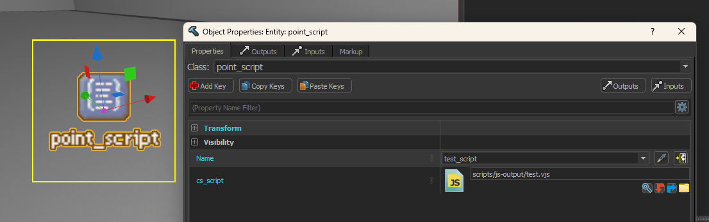

# Intro

cs_script is a <Tool name="js"/> based scripting system for Counter-Strike maps.

It is a virtual machine for scripting which exposes various Source2 engine functionality and Counter-Strike specific info such as listening to events, accessing player data, firing I/O events, getting data about gamemodes, etc.

:::warning
Despite the system being JavaScript based, this guide will use [<Tool name="ts"/>](https://www.typescriptlang.org/) due to the much better user experience and because
Valve's documentation is also in TypeScript.
:::

:::info
`script_zoo.vmap` is a Valve made map to demonstrate basic functionality of the system, it can be found in 
`Steam\steamapps\common\Counter-Strike Global Offensive\content\csgo\maps\editor\zoo\script_zoo.vmap`
:::

## TypeScript Setup

There are a few projects which provide a TypeScript wrapper over the cs_script JavaScript API, we will be using [Source2ZE cs_script_boilerplate](https://github.com/Source2ZE/cs_script_boilerplate).

Follow the README of the project from above to setup TypeScript in your addon.

To use a script in your map, add a [point_script](/Entities/point_script) entity, give it a reasonable name, and in the `cs_script` field select your generated .vjs script from the asset browser.

## Bugs

:::danger
Due to this system being very new it contains many bugs, this section is here to try to save your sanity.
:::

- Sometimes the script will only run the first time you load into a map, disconnecting and reloading or typing `restart` in the console will stop the script from running unless you restart the game.

- `RunScriptInput` input crashes if activator or caller are null, using a trigger_once (automatically kills itself) to fire the input with a delay will crash since the caller becomes null, same goes for if a player triggers an input then disconnects before the input runs! 

- Teleporting a player every frame breaks movement.