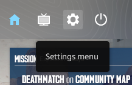
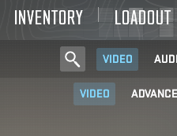
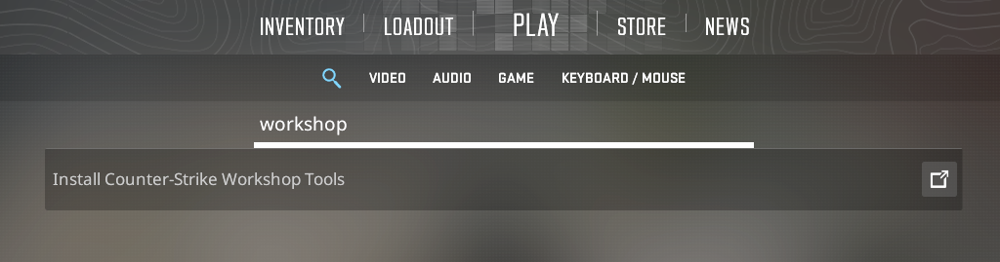
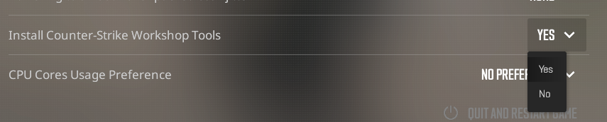
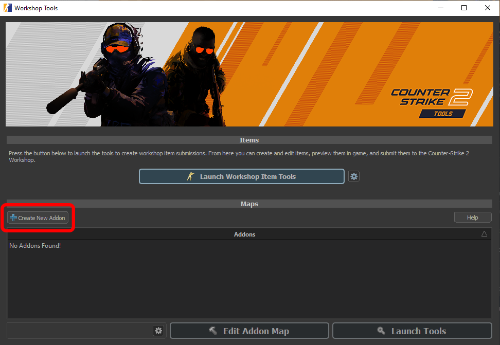
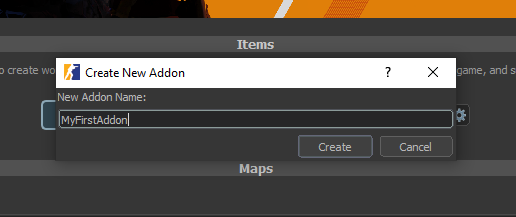
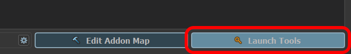

1. Launch <Game name="cs2" /> from **Steam**.  
2. Click on the **Settings menu**. 
3. Search for **Install Counter-Strike Workshop Tools**.
4. Change the setting to **Yes**.

  
  
  
  

After this quit out of the game, and wait for the workshop tools to install.

# Launching the Workshop Tools
After installation, the tools can be accessed through the **Addon Launcher**. To open it:  

1. Launch <Game name="cs2" /> from Steam.  
2. In the startup menu, select **Counter-Strike 2 Workshop Tools**.  

:::info
The Addon Launcher can also be started directly from the installation directory:  
`bin/win64/cs2cfg.exe`  
:::

  

To launch the Workshop tools:

- Click on **Create New Addon**.  
- Give your addon a **name** and click **Create**. 
- Click on **Launch Tools** to open the Workshop tools.  

:::danger
Make sure to press on **Launch Tools** and NOT **Edit Addon Map**, the latter is broken and should not be used!
:::

  
  
  