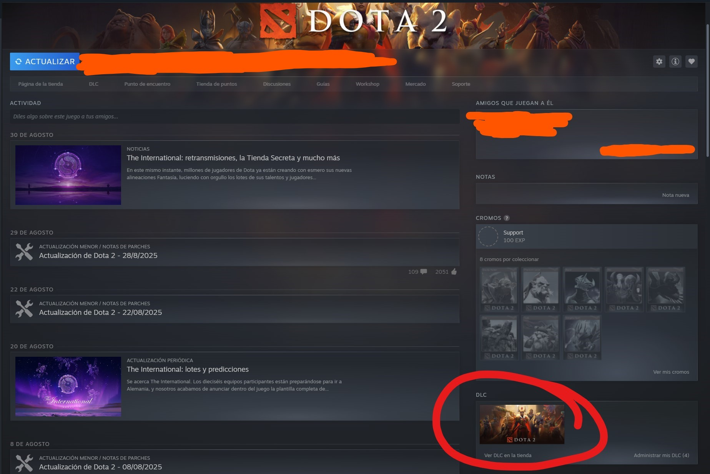
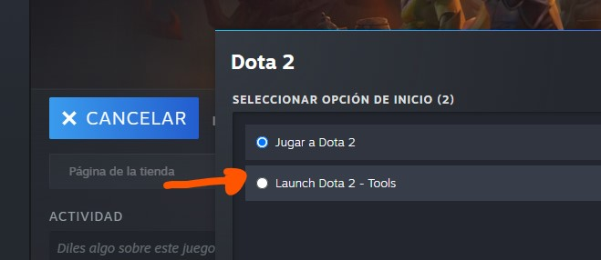

1. Open <Game name="dota2" /> in your **Steam Library**.  
2. Scroll down to the **DLC** section.  
3. Locate the entry labeled **Workshop Tools** and install it.  

  
  

# Launching the Workshop Tools
After installation, the tools can be accessed through the **Addon Launcher**. To open it:  

1. Launch <Game name="dota2" /> from Steam.  
2. In the startup menu, select **Tools**.  

:::info
The Addon Launcher can also be started directly from the installation directory:  
`bin/win64/dota2cfg.exe`  
:::

  

To launch the Workshop tools:
- Create a new addon.  
- Open the Workshop Tools.  

  
  

