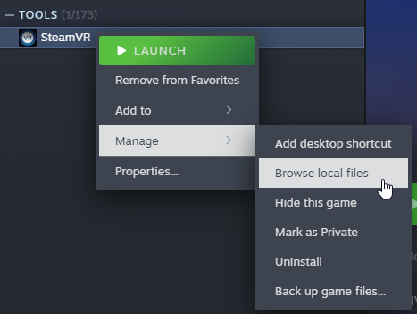
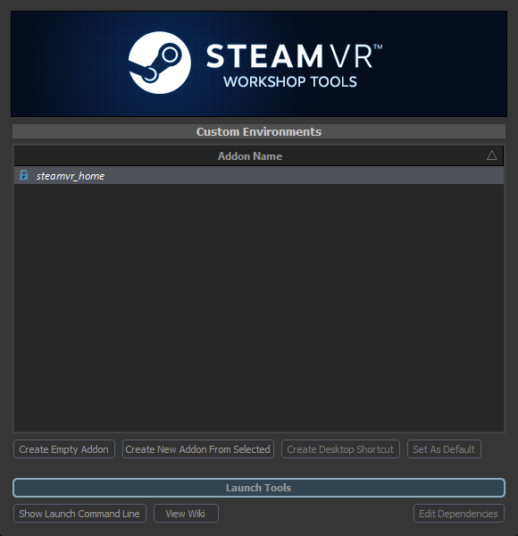

<Game name="steamvr"/> ships with Workshop Tools by default. To find the tools application browse local files for SteamVR:

  

The tools can be launched via: `SteamVR\tools\steamvr_environments\game\bin\win64\steamtourscfg.exe`

 
